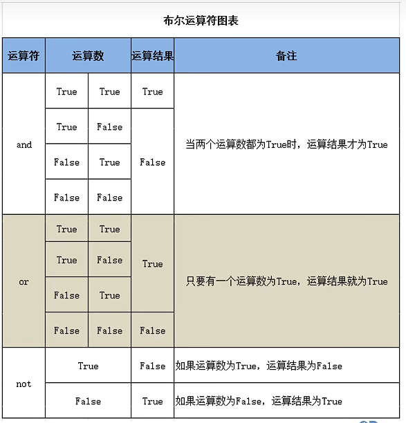
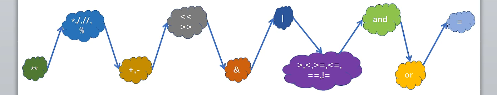

### Day04

---

## 赋值运算符

* 从右到左运算

* 支持链式赋值 a = b = c = 20

* 支持参数赋值 += -= *= /= //= %=

* 支持系列解包赋值 a,b,c = 20,30,40

  ### 交换

  a,b = b,a

---

## 比较运算符

对变量或表达式的结果进行大小、真假等比较

\> < >= <= !=

== 对象value的比较

is,is not对象id的比较

* =赋值运算符，==比较运算符（比较的是值）
* is比较对象的标识使用

---

## 布尔运算符

and、or、  not、 in 、not in




eg:

a,b = 1,2

print(a==1 and b==2)#True

* not对布尔类型的操作数取反

* in，not in

---

## 位运算

位与&  对应数位都是1，结果数位才是1，否则为0

位或|   对应数位都是0，结果数位才是0，否则为1

左移位运算符<<  高位溢舍弃，低位补0

右移位运算符>>   低位移除舍弃，高位补0

<u> 转换成二进制，用二进制理解</u>

---

## 运算符的优先级




* （）

* 算术运算 幂
* 乘除
* 加减
* 位运算 
* 比较运算
* 赋值运算符

---

---

## 组织结构——顺序结构

> 顺序结构
>
> 选择结构 if语句
>
> 循环结构 while语句、for-in语句

---

## 对象的布尔值

<u>一切皆对象,所有对象都有一个布尔值</u>

* false
* 数值0
* 空字符串
* 空列表
* 空元组
* 空字典
* 空集合

---

## 单分支结构

``` Python
money = 1000

s = int(input('请输入取款金额'))

if money >= s:

	money = money - s

	print('取款成功，余额为；',money)
```

---

## 双分支结构

```python
num = int(input('请输入一个整数') )

if num % 2 == 0:

	print(num,'是偶数)

else:

print('是奇数')
```


---

## 多分支结构

```py
score = input('请输入成绩')

if score >= 90 and score <= 100:	#也可以90<=score<=100

	print('A')

elif score >= 80 and score <=89:

	print('B')

elif score >=70 and score <=79:

	print('C')

elif score >=60 and score <= 69:

	print('D')

elif score >=0 and score <=59:

	print('E')

else:

	print('对不起')
```


---


