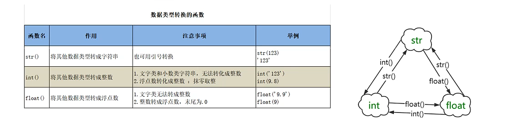

# Day02

---

## 转义字符

\\ \  反斜杠\

\'  单引号

\" 双引号

\n  换行

\t   制表位（占4个字符）

\r  回车

print（"hello\rworld"）>world

\b  退位

print("hello\bworld") >hellworld

### 原字符

不希望转义字符起作用

在字符串之前加r/R

print(r"hello\nworld\\") 

---

chr() 转成字符型

print(chr(0b100111001011000))

ord() 转成十进制

print(ord(‘乘’))

---

## 标识符和保留字

* 字母、数字、下划线
* 不能以数字开头
* 不能是保留字
* 严格区分大小写

---

## 变量

由标识、类型、值组成

id(obj)、type(ojb)、print(obj)

内存垃圾：多次赋值，会被覆盖

 

数据类型：int float bool str

---

### 整数类型

默认十进制

还可以二进制0b、八进制0o、十六进制0x

---

### 浮点类型

浮点数计算可能会出现小数位不确定的情况

可导入模块解决

from decimal import Decimal

print(Decimal('1.1')+Decimal('2.2'))

---

### 布尔类型

True 1

False 0

---

### 字符串类型

可以用单引号、双引号、三引号

三引号可以分散多行

---

## 数据类型转换

