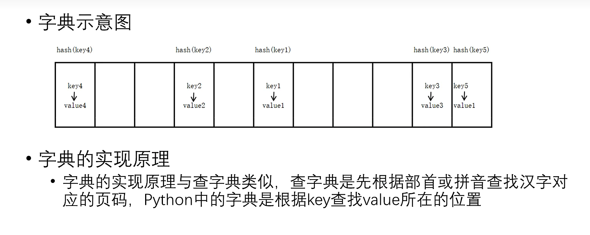

## Day09

---

## 列表元素的修改操作

* 为指定索引的元素赋予一个新值
* 为指定的切片赋予一个新值

```python
lst = [10,20,30,40]
lst[2] = 100
print(lst)
lst[1:3] = [300,400,500,600]
print(lst)
```


---

## 列表元素的排序操作

* 调用`sort()`方法，列有中的所有元素默认按照从小到大的顺序进行排序们可以指定reverse = True，进行降序排序
* 调用内置函数sorted()，可以指定reverse = True，进行降序排序，原列表不发生改变

```python
lst = [20,40,10,98,54]
print('排序前的列表',lst,id(lst))
#开始排序，调用列表对象的sort()方法，默认是升序
lst.sort()
print('排序后的列表',lst,id(lst))

#通过指定关键字参数，将列表中的元素进行降序排序
lst.sort(reverse = True)	#降序
print(lst)
lst.sort(reverse = False)	#升序
print(lst)

print('---------------内置函数sorted(),将产生一个新的列表对象')
lst = [20,40,10,98,54]
print('原列表',lst)
new_lst = sorted(lst)
print(lst)
print(new_lst)
#降序
desc_new = sorted(lst,reverse = True)
print(desc_lst)
```


---

## 列表生成式

* 语法格式[`i*i` for `i` in range(1,10)]
  * `i*i`表示列表元素的表达式，列表中真正的值
  * `i`自定义变量
  * range(1,10)可迭代对象
* 注意事项：“表示列表元素的表达式”中通常包含自定义变量

```python
lst = [i for i in range(1，10)]
#输出[1,2,3,4,5,6,7,8,9]
print(lst)
lst = [i*i for i in range(1，10)]
#输出[1,4,9,16,25,36,49,64,81]
print(lst)

'''列表中的元素的值为2，4，6，8，10'''
lst2 = [i * 2 for i in range(1,6)]
print(lst2)
```


---

## 字典

### 什么是字典

* 内置的数据结构之一，也是一个可变序列
* 键值对的方式存储数据，是一个无序的序列

```python
score = {'张三' : 100, '李四' : 98, '王五' : 45}
```



### 字典的创建

* 

```python
scores = {'张三' : 100, '李四' : 98, '王五' : 45}
```

* 

```python
dict(name='jack',age=20)
```

### 字典的常用操作

* 字典中元素的获取
  * [ ]	`scores['张三']`
  * get()方法    `scores.get('张三')`

* [ ]取值与使用get()取值的区别
  * [ ]如果字典中不存在指定的key，抛出`keyError`异常
  * get()方法取值，如果字典中不存在指定的key，并不会抛出`KeyError`而是返回None，可以通过参数设置默认的value,以便指定的key不存在时返回

```python
scores = {'张三' : 100, '李四' : 98, '王五' : 45}
print(scores['张三'])
print(scores.get('张三'))
print(scores.get('陈六'))	#返回None
print(scores.get('玛奇',99))	#输出99
```

---

## 字典元素的增删改

* key的判断

  * in	指定key在字典中存在返回True
  * not in    指定的key在字典中不存在返回True

* 字典元素的删除

  ```python
  del scores['张三']
  ```

* 字典元素的新增

  ```python
  scores['Jack'] = 90
  ```

  

```python
scores = {'张三' : 100, '李四' : 98, '王五' : 45}
print('张三' in scores)
print('张三' not in scores)

del scores('张三')	#删除指定的键值对
scores.clear()	#清空字典中的所有元素
print(scores)
scores['陈六'] = 98
print(scores)

scores['陈六'] = 100
print(scores)
```

