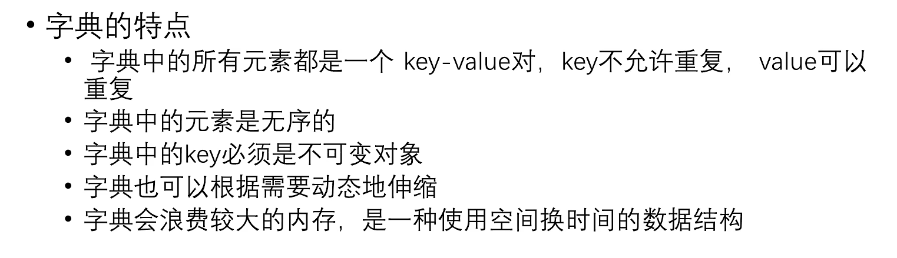
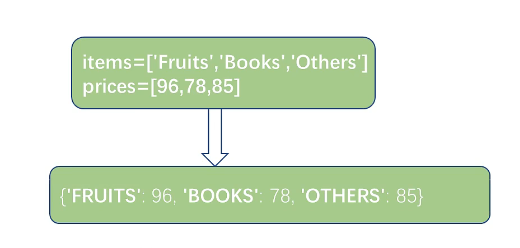

## Day10

---

## 获取字典视图的三个方法

* keys()获取字典中所有key
* values()获取字典中所有的value
* items()获取字典中所有的key,value对

```python
scores  = ['张三':100,'李四':98,'王五':46]
keys = scores.keys()
print(keys)	#输出dict_keys(['张三','李四','王五'])
print(type(keys))	#输出dict_keys类型
print(list(keys))	#转换成列表
```

```python
scores  = ['张三':100,'李四':98,'王五':46]
values = scores.values()
print(values)
print(type(values))
print(list(values))
```

```python
scores  = ['张三':100,'李四':98,'王五':46]
items = scores.items()
print(item)	输出dict_items([('张三',100),('李四',98),('王五',46)])这是一个列表元组，元组（，）
```


---

## 字典元素的遍历

```python

scores  = ['张三':100,'李四':98,'王五':46]
for item in scores:
    print(item,scores[item],scores.get(item))
'''
输出
张三 100 100
李四 98 98
王五 46 46
'''
```


---

## 字典的特点



* 因为是无序的所以不可以像列表一样插入在任意位置
*  不可以用列表做键，因为要求不可变对象


---

## 字典生成式



### 内置函数zip()

```python
items = ['Fruits','Books','Others']
prices = [96,78,85]
d = {item.upper():price for item,price in zip(items,prices)}
print(d)
```

* `upper()`大写字母
* 压缩过程以短的那个压缩eg:

```python
items = ['Fruits','Books','Others']
prices = [96,78,85,100,200]
#输出：['Fruits':96,'Books':78,'Others':85]
```


---

## 元组

* Python内置数据结构之一，是一个不可变序列

**不可变序列与可变序列**

* 不可变序列：字符串、元组
  * 不可变序列：没有增删改查的操作

* 可变序列：列表、字典
  * 可变序列：可以对序列执行增删改操作，对象地址发生更改


```python
#可变序列	列表，字典
lst = [10,20,30]
print(id(lst))
lst.append(300)
print(id(lst))
#不可变序列，字符串、元组
s = 'hello'
print(id(s))
s += 'world'
print(id(s)) 
print(s)
```


---

## 元组的创建方式

* 直接小括号,小括号可以省略 

  ```python
  t = ('Python','hello',90)
  ```

* 使用内置函数tuple()

  ```python
  t = tuple(('Python','hello',90))
  ```

* 只包含一个元组的元素需要使用逗号和小括号

  ```python
  t = (10,)
  ```

  

 

