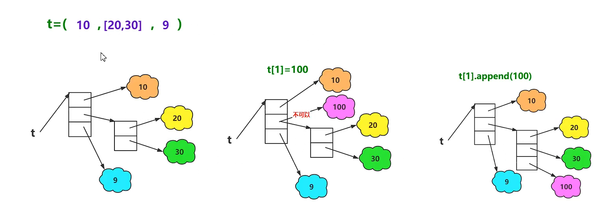
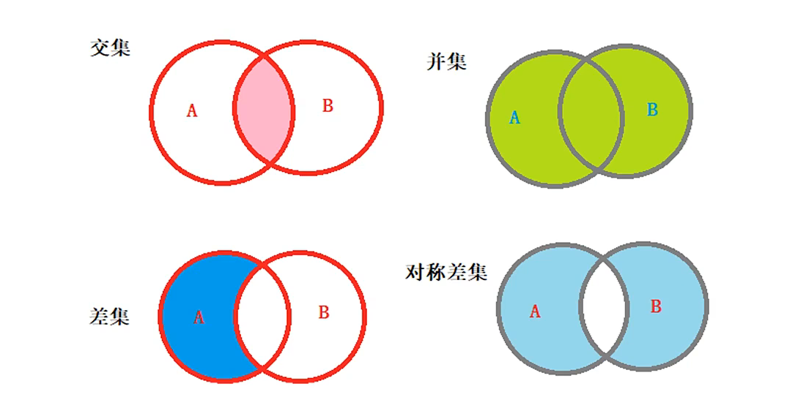
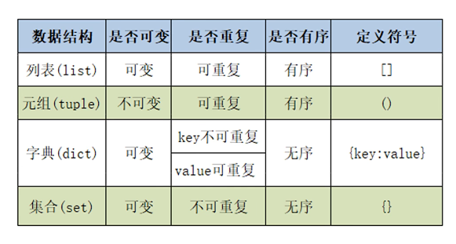
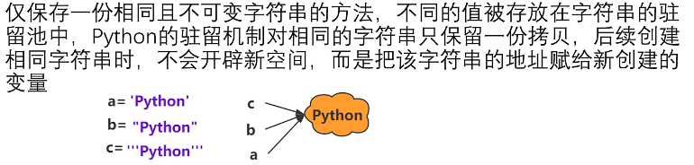
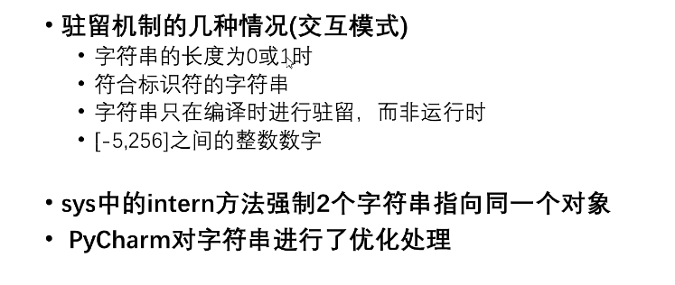
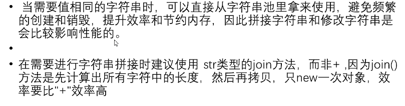

## Day11

---

## 为什么将元组设计成可变序列

* 在多任务环境下，同时操作对象时不需要加锁

* 因此，在程序中尽量使用不可变序列

* 注意事项：

  * 元组中存储的时对象的引用

    a)如果元组中对象本身不可变对象，则不能引用其他对象

    b)如果元组中的对象时可变对象，则可变对象的引用不允许改变，但数据可以改变



```python
t = (10,[20,30],9)
print(t)
print(type(t))
print(t[0],type(t[0]),id(t[0]))
print(t[1],type(t[1]),id(t[1]))
print(t[2],type(t[2]),id(t[2]))
#尝试将t[1]修改为100
print(id(100))
#t[1] = 100	#报错，元组不允许修改元素
t[1].append(100)
print(t,id(t[1]))	#物理地址不会改变
```

* `id()`查看内存的地址


---

## 元组的遍历

* 元组是可迭代对象，所以可以使用for...in进行遍历

```python
t = ('Python','world',98)
#使用索引
print(t[0])
print(t[1])
print(t[2])
#print(t[3])	IndexError,超出范围

#遍历
for item in t:
    print(item)
```


---

## 集合

* Python语言提供的内置数据结构
* 与列表、字典一样都属于可变类型的序列
* 集合是没有value的字典

**添加数据也会进行hash函数进行计算**

### 集合的创建方式

* 直接{}
* 使用内置函数set()

```python
#使用{}
s = {2,3,4,5,5,6,7,7}	#和字典一样不能存储重复，会去掉重复的，输出{2,3,4,5,6,7}
print(s)

#使用set()
s1 = set(range(6))
print(s1,type(s1))
s2 = set([1,2,3,3,4,5,5])
print(s2)	#将列表转换成集合，并去掉重复的
s3 = set((1,2,3,3,4,5))	#输出是无序的
print(s3)
s4 = set('Python')
print(s4)#输出{'n','h','p','y','o'}
s5 = set({12,3,4,4,55,7})
print(s5)
s6 = set()
print(s6)
```

* 如果创建一个空集合，不可以直接用``s = {}``，会输出成字典


---

## 集合的相关操作

* 集合元素的判断操作
  * in或not in
* 集合元素的新增操作
  * 调用`add()`方法，一次添加一个元素
  * 调用`update()`方法至少添加一个元素
* 集合元素的删除操作
  * 调用`remove()`方法，一次删除一个指定元素，如果指定的元素不存在抛出`KeyError`
  * 调用`discard()`方法，一次删除一个指定元素，如果指定的元素不存在不抛出异常
  * 调用`pop()`方法，一次只删除一个任意元素
  * 调用`clear()`方法，清空集合

```python
s = {10,20,30,405,60}
#集合元素的判断操作
print(10 in s)#True
print(100 in s)#False
print(10 not in s)#False
print(100 not in s)#True

#集合元素的新增操作
s.add(80)
print(S)
s.update({200,300,400})
print(s)
s.update((78,64,56))
print(s)

#集合的删除操作
s.remove(100)
print(s)
s.remove(500)#抛出KeyError
print(s)
s.discard(500)
print(s)
s.pop()	#删除任意，没有参数的
print(s)
s.clear()
print(s)
```


---

## 集合间的关系

* 两个集合是否相等
  * 可以使用运算符`==`或`!=`进行判断
* 一个集合是否是另一个集合的子集
  * 可以调用方法`issubset`进行判断
  * B是A的子集
* 一个集合是否是另一个集合的超集
  * 可以调用方法`issuperset`进行判断
  * A是B的超集
* 两个集合是否没有交集
  * 可以调用方法`isdisjoint`进行判断

```python
s = {10,20,30,40}
s2 = {30,40,20,10}
#两个集合是否相等，元素相同就相等
print(s == s2)	#True
print(s != s2)	#False
#子集
s1 = {10,20,30,40,50,60}
s2 = {10,20,30,40}
s3 = {10,20,90}
print(s2.issubset(s1))	#True
print(s3.issubset(s1))	#False
#超集
s1 = {10,20,30,40,50,60}
s2 = {10,20,30,40}
s3 = {10,20,90}
print(s1.issuperset(s2))	#True
print(s1.issuperset(s3))	#False
#交集
s1 = {10,20,30,40,50,60}
s2 = {10,20,30,40}
s3 = {10,20,90}
print(s2.isdisjoint(s3))	#False
s4 = {100,200,300}	#True
```

* 有交集就是False，没有交集是True------理解：disjoint不相交


---

## 集合的数学操作



```python
#1、
s1 = {10,20,30,40}
s2 = {20,30,40,50,60}
print(s1.intersection(s2))#intersection交集等价于&，求交集
print(s1 & s2)
#2、
s1 = {10,20,30,40}
s2 = {20,30,40,50,60}
print(s1.union(s2))
print(s1 | s2)	#union联合、并集等价于|，求并集
#3、
print(s1.difference(s2))
print(s1-s2)	#difference差异等价于-，求差集
#4、
print(s1.symmetric_difference(s2))
print(s1 ^ s2)	#symmetric_difference对称差异等价于^,求对称差集
```


---

## 集合生成式

* 用于生成集合的公式
  * {`i*i` for `i` in range(1,10)}
* 将{ }修改成[ ]就是列表生成式
* 没有元组生成式

```python
#列表生成式
lst = [i*i for i in range(10)]
print(lst)

#集合生成式
s = {i*i for i in range(10)}
print(s)


```




---

## 字符串的创建与驻留机制

* 字符串

在python中字符串是基本数据类型，是一个不可变的字符序列



```python
a = 'Python'
b = "Python"
c = '''Python'''
print(a,id(a))
print(b,id(b))
print(c,id(c))
```


* 字符串的驻留机制

  

  * 像%就不是符合标识符
  * 运行之前，像join()就需要运行之后调用这个方法
  * `a = sys.intern(b)`

* 字符串驻留机制的优缺点

  


---

## 字符串的常用操作

### 查询操作

| 功能     | 方法名称   | 作用                                                         |
| -------- | ---------- | ------------------------------------------------------------ |
| 查询方法 | `index()`  | 查找子串`substr`第一次出现的位置,如果查找的字串不存在时，则抛出`ValueError` |
|          | `rindex()` | 查找子串`substr`最后一次出现的位置,如果查找的字串不存在时，则抛出`ValueError` |
|          | `find()`   | 查找子串`substr`第一次出现的位置,如果查找的字串不存在时，则返回-1 |
|          | `rfind()`  | 查找子串`substr`最后一次出现的位置,如果查找的字串不存在时，则返回-1 |

* r应为rear，后方的

```python
s = 'hello,hello'
print(s.index('lo'))	#输出3
print(s.find('lo'))
print(s.rindex('lo'))	#输出9
print(s.rfind('lo'))
```

建议用`find()`方法，不会报错

### 大小写转换

| 功能       | 方法名称       | 作用                                                         |
| ---------- | -------------- | ------------------------------------------------------------ |
| 大小写转换 | `upper()`      | 把字符串中所有都转成大写字母                                 |
|            | `lower()`      | 把字符串中所有都转成小写字母                                 |
|            | `swapcase()`   | 把字符串中所有大写字母转成小子字母，把所有小写字母都转成大写字母 |
|            | `capitalize()` | 把第一个字符转换成大写，把其余字符转换成小写                 |
|            | `title()`      | 把每个单词的第一个字符转换成大写，把每个单词的剩余字符转换成小写 |

```python
s = 'hello,python'
a = s.upper()
print(a)	#HELLO,PYTHON
#转换之后会产生一个新的字符串对象，物理地址发生改变，即使值相同
b = s.lower()
print(b)
print(b == a)	#判断值，True
print(b is a)	#判断内存地址，False
```

```python
s2 = 'hello,Python'
print(s2.swapcase())

print(s2.title())
```

### 对齐操作

| 功能       | 方法名称   | 作用                                                         |
| ---------- | ---------- | ------------------------------------------------------------ |
| 字符串对齐 | `center()` | 居中对齐，第一个参数指定宽度，第二个参数指定填充符，第二个字符是可选的，默认是空格，如果设置宽度小于实际宽度则返回原字符串 |
|            | `ljust()`  | 左对齐，第一个参数指定宽度，第二个参数指定填充符，第二个字符是可选的，默认是空格，如果设置宽度小于实际宽度则返回原字符串 |
|            | `rjust()`  | 右对齐，第一个参数指定宽度，第二个参数指定填充符，第二个字符是可选的，默认是空格，如果设置宽度小于实际宽度则返回原字符串 |
|            | `zfill()`  | 右对齐，左边用0填充，该方法只接收一个参数，用于指定字符串的宽度，如果设置宽度小于实际宽度则返回原字符串 |

```python
s = 'hello,Python'
print(s.center(20，*))
#输出 ****hello,Python****
print(s.ljust(20,*))
#输出hello,Python********
print(s.ljust(10))
#输出hello,Python
print(s.ljust(20))
#输出hello,Python        (有八个空格)

print('-8910'.zfill(8))
#输出-0008910
```

### 劈分操作

| 功能         | 方法名称   | 作用                                                         |
| ------------ | ---------- | ------------------------------------------------------------ |
| 字符串的劈分 | `split()`  | 从字符串的左边开始劈分，默认的劈分字符是空格字符，返回的值都是一个列表 |
|              |            | 以通过参数`sep`指定劈分字符串的劈分符                        |
|              |            | 通过参数`maxsplit`指定劈分字符串时的最大劈分次数，在经过最大劈分之后，剩余的子串会单独做为一部分 |
|              | `rsplit()` | 从字符串的右边开始劈分，默认的劈分字符是空格字符，返回的值都是一个列表 |
|              |            | 以通过参数`sep`指定劈分字符串的劈分符                        |
|              |            | 通过参数`maxsplit`指定劈分字符串时的最大劈分次数，在经过最大劈分之后，剩余的子串会单独做为一部分 |

```python
s = 'heelo world Python'
lst = s.split()
print(lst)
#输出['hello','world','Python']
s1 = 'hello|world|Python'
print(s1.split(sep='|'))
print(s1.split(sep='|',maxsplit=1))
```

### 判断

| 功能             | 方法名称         | 作用                                                         |
| ---------------- | ---------------- | ------------------------------------------------------------ |
| 判断字符串的方法 | `isidentifier()` | 判断指定的字符是不是合法的标识符                             |
|                  | `isspace()`      | 判断指定的字符串是否全部有空白字符组成（回车、换行、水平制表符） |
|                  | `isalpha()`      | 判定指定的字符串是否全部由字母组成                           |
|                  | `isdecimal()`    | 判定指定字符串是否全部由十进制的数字组成                     |
|                  | `isnumeric()`    | 判定指定的字符串是否由全部数字组成                           |
|                  | `isalnum()`      | 判定指定字符串是否全部由字母和数字组成                       |

```python
s = 'hello,python'
print(s.isidentifier())
#False

print('\t'.isspace())	#True

print('abc'.isalpha())	#True
print('张三'.isalpha())	#True
print('张三1'.isalpha())	#False

print('123'.isdecimal())	#True
print('123四'.isdecimal())	#False

print('123'.isnumeric())	#True
print('123四'.isnumeric())	#True
#除此之外还有罗马数字

print('zbc123'.isalnum)	#True
print('张三123'.isalnum)	#True

```

* 合法的标识符:字母、数字、下划线

### 替换与合并

| 功能         | 方法名称    | 作用                                                         |
| ------------ | ----------- | ------------------------------------------------------------ |
| 字符串替换   | `replace()` | 第一个参数指定被替换的子串，第二个参数指定替换子串的字符串，该方法返回替换后得到的字符串，替换前的字符串不发生变化，调用该方法是可以用过第三个参数指定最大替换次数 |
| 字符串的合并 | `join()`    | 将列表或元组的字符串合并成一个字符串                         |

```python
s = 'hello,Python'
print(s.replace('Python','Java'))
s1 = 'hello,Python,Python,Python,Python'
print(s.replace('Python','Java',2))

lst = ['hello','Python','Java']
print('|'.join(lst))
print(''.join(lst))

t = ('hello','Java','Python')
print(''.join(t))

print('*'.join('Python'))
#输出P*y*t*h*o*n

```

