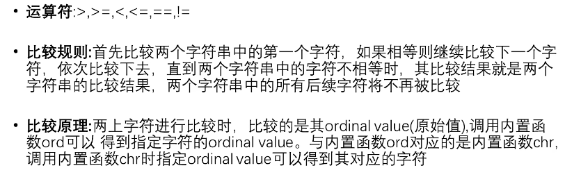
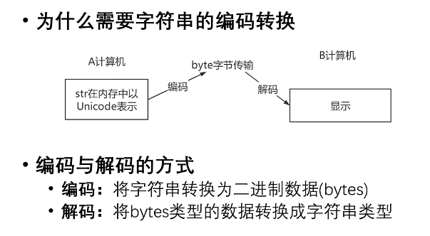

## Day12

## 字符串的比较操作



```python
print('apple' > 'app')	#True	#True
print('apple' > 'banana')	#False
print(ord('a'),ord('b'))
print(ord('杨'))	#输出26472

print(chr(97),chr(98))
print(chr(26472))

a = b = 'Python'
print(a==b)	#True
print(b==c)	#True

print(a is b)	#True
print(a is c)	#True
```

* ==与is的区别
  * == 比较的是value
  * is 比较的是id是否相等


---

## 字符串的切片

* 字符串是不可变类型
  * 不具备增删改等操作
  * 切片操作将产生新的对象

```python
s = 'hello,Python'
s1 = s[:5]
s2 = s[6:]
s3 = '!'
newstr = s1+s3+s2

print(s1)
print(s2)
print(newstr)
```

* [`start`:`end`:`step`]


---

## 格式化字符串

* %作为占位符
  * %s 字符串
  * %i或%d 整数
  * %f 浮点数
* { }作为占位符

```python
name = '张三'
age = 20
print('我叫%s,今年%d岁' % (name,age))

print('我叫{0},今年{1}岁,真的是{0}'.format(name,age))

print(f'我叫{name},今年{age}岁')
```

```python
print('%10d' % 99)	#10表示宽度
print('%.3f' % 3.1415926)	#表示保留三位小数
print('%10.3f' % 3.1415926)
```

```python
print('{0:.3}'.format(3.1415926))	#3表示三位数字3.14
print('{0:.3f}'.format(3.1415926))	#3表示三位小数
print('{0:10.3f}'.format(3.1415926))	#3表示三位小数
```


---

## 字符串的编码转换



```python
s = '天涯共此时'
print(s.encode(encoding='GBK'))	#GBK编码格式中，一个中文占两个字符
print(s.encode(encoding='UTF-8'))	#UTF-8编码格式中，一个中文占三个字符

byte = s.encode(encoding='GBK')
print(byte.decode(encoding='GNK'))
```


---

## 函数的定义与调用

* 什么是函数

  * 函数就是执行特定任和以完成特定功能的一段代码

* 为什么需要函数

  * 复用代码
  * 隐藏实现细节
  * 提高可维护性
  * 提高可读性便于调试

* 函数的创建

  * ```python
    def 函数名 ([输入参数]):
        函数体
        [return ...]
    ```

```python
def calc(a,b):
    c = a + b
    return c

result = calc(10,20)
print(result)
```

