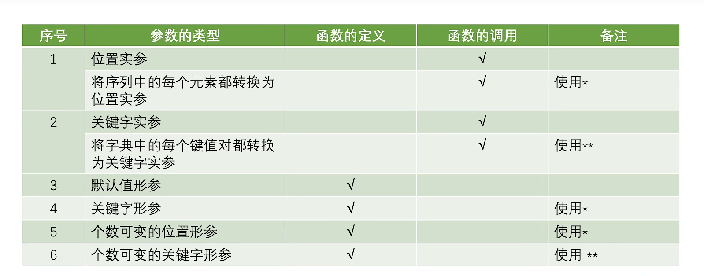

## Day13

## 函数调用的参数传递

* 函数调用的参数传递
  * 位置实参
    * 根据形参对应的位置进行实参传递
  * 关键字实参
    * 根据形参名称进行实参传递

```python
def calc(a,b):	#a,b是形式参数，简称形参，位置是在函数的定义处
    c = a+b
    return c

result = calc(10,20)	#10，20称为实际参数，简称实参，位置是在函数的调用处
print(result)

res=calc(b=10,a=20)	# =左侧的变量称为关键字参数
print(res)
```

* 形参和实参可以名称不一样
* 在函数调用过程中，进行参数的传递，如果是不可变对象，在函数的修改不会影响实参的值
* 在函数调用过程中，进行参数的传递，如果是可变对象，在函数的修改会影响实参的值

```python
def fun(arg1,arg2):
    print('arg1:',arg1)
    print('arg2:',arg2)
    arg1 = 100
    arg2.append(10)
    print('arg1:',arg1)
    print('arg2:',arg2)
    
n1 = 11
n2 = [22,33,44]
print('n1',n1)
print('n2',n2)
fun(n1,n2)	#将位置传参，实参与形参名称可以不相同

print('n1',n1)
print('n2',n2)
#最终输出
#n1 11
#n2 [22,33,44,10]

```


---

## 函数的返回值

* 函数返回多个值时，结果为元组
* 如果函数没有返回值，【执行函数完毕之后，不需要给调用处提供数据】return可以省略不写
* 函数的返回值，如果是1个，直接返回类型

```python
#非0为True，0为False
def fun(num):
    odd = []
    even = []
    for i in num:
        if i % 2:
            odd.append(i)
        else:
            even.append(i)
     return odd,even

print(fun([10,29,34,23,44,53,55])
```

```python
def fun1():
    print('hello')
    #return
    
fun1()
```

```python
def fun2():
    return 'hello'

res = fun2()
print(res)
```

```python
def fun3():
	return 'hello','world'
print(fun3())
#函数在定义时，是否需要返回值，视情况而定
```


---

## 函数的参数定义

* 函数定义默认值参数
  * 函数定义时，给形参设置默认值，只有与默认值不符的时候才需要传递实参

```python
def fun(a,b = 10):
    print(a,b)
    
fun(100)
fun(20,30)	#30会替换掉10
```


* 个数可变的位置参数
  * 定义函数时，可能无法事先确定传递的位置实参的个数时，使用可变的位置参数
  * 使用*定义个数可变的位置形参
  * 结果为一个元组
* 个数可变的关键字参数
  * 定义函数时，无法事先确定传递的关键字实参的个数时，使用可变的关键字参数
  * 使用**定义个数可变的关键字形参
  * 结果为一个字典

```python
def fun(*args):
    print(args)
    #print(args[0])
    
fun(10)
fun(10,30)
fun(30,105,50)
lst = [11,33,22]
fun(*lst)	#在函数调用时，将列表中的每个元素都转换为位置实参传入
```

```python
def fun1(**args):
    print(args)
    
fun1(a=10)
fun1(a=1,b=2,c=3)
dic = {'a':111,'b':222,'c':333}
fun(**dic)
'''
def fun2(*args,*a):
	pass#报错，只能是一个

def fun2(**args,**a):
	pass
	
	
def fun2(*args,**args)
'''
```



```python
def fun(a,b,*,c,d):
    print(a)
    print(b)
    print(c)
    print(d)
    
fun(10,20,c=30,d=40)
#从*之后必须要关键字传参传入参数
```


---

## 变量的作用域

* 程序代码能访问该变量的区域

* 根据变量的有效范围可分为

  * 局部变量
    * 在函数内定义并使用的变量，只在函数内部有效，局部变量使用global声明，这个变量就会变成全局变量
  * 全部变量
    * 函数体外定义的变量，可作用于函数体外

  

```python
def fun(a,b):
    c = a + b	#c是局部变量，a,b为形参，也相当于局部变量
    print(c)
    
print(a)#报错，超出作用域范围，在函数体外

name='li'
print(name)
def fun1():
    print(name)
fun1()


def fun2():
    global age
    age = 20
    print(age)
fun2()
print(age)
```


---

## 递归函数

* 什么是递归函数
  * 如果在一个函数的函数体内调用了该函数本身，这个函数就成为递归函数
* 递归的组成部分
  * 递归调用与递归终止条件
* 递归的调用过程
  * 每递归调用一次函数，都会在栈内存分配一个栈帧
  * 每执行完一次函数，都会释放相应的空间
* 递归的优缺点
  * 缺点：占用内存多，效率低下
  * 优点：思路和代码简单

```python
#计算阶层
def fac(n):
    if n==1:
        return 1
    else:
        return n*fac(n-1)
    
print(fac(6))
```

