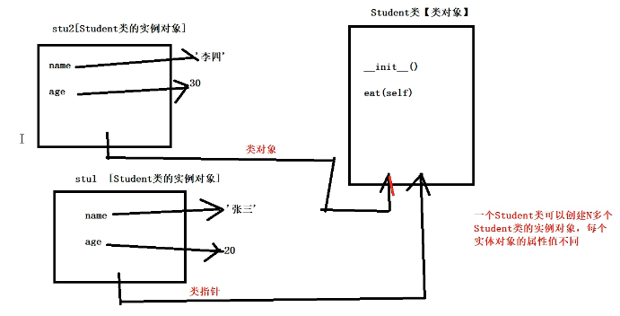
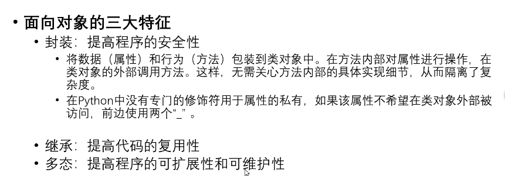

## Day15

---

## 类属性、类方法、静态方法

* 类属性：类中方法的变量称为类属性，被该类的所有对象所共享
* 类方法：使用`@classmethod`修饰的方法，使用类名直接访问的方法
* 静态方法：使用`@staticmethod`修饰的主法，使用类名直接访问的方法

```python
print(Student.native_place)	#访问类属性
Student.cm()	#调用类方法
Student.sm()	#调用静态方法
```

```python
class Student:	#Student为类名，由一个或多个单词组成，每个单词首字母必须大写，其余小写
    native_pace = '广东'	#类属性
    def __init__(self,name,age):
        self.name=name	#self.name称为实体属性，进行了一个赋值的操作，将局部变量的name的值赋给实体属性
        self.age=age
    #实例方法
    def eat(self):	#self可以换成其他的，通常是self
        print('学生在吃饭...')
      
    #静态方法
    @staticmethod
    def method():
        print('我使用staticmethod进行修饰，所以我是静态方法')

        
    #类方法
    @classmethod
    def cm(cls):
        print('我是类方法，使用了classmethod进行修饰')
        
#print(Student.native_place)
stu1 = Student('张三',20)
stu2 = Student('李四',30)
print(stu1.native_place)
print(stu2.native_place)
Student.native_place = '天津'	#输出如果会变
print(stu1.native_place)
print(stu2.native_place)
```


---

## 动态绑定属性和方法

* Python是动态语言，在创建对象之后，可以动态地绑定属性和方法

  ```python
  def show():
      print('我是一函数')
  stu = Student('jack',20)
  stu.gender= '男'	#动态绑定性别
  print(stu.name,stu.age,stu.gender)
  stu.show=show	#动态绑定方法
  stu.show()
  ```

  

```python
class Student:
    def __init__(self,name,age):
        self.name = name
        self.age = age
    def eat(self):
        print(self.name+'在吃饭')
        
stu1 = Student('张三',20)
stu2 = Student('李四',30)
print(id(stu1))
print(id(stu2))
print('---------为stu2动态绑定性别属性--------')
stu2.gender('男')
print(stu1.name,stu1.age)
print(stu2.name,stu2.age,stu2.gender)

print('------------------------')
stu1.eat()
stu2.eat()
def show():
    print('定义在类之外的，称为函数')
stu1.show=show
stu1.show()

#stu2.show()	#因为stu2并还没有绑定show方法

```




---

## 封装的实现方式

* 面向对象的三大特征



```python
class Car:
    def __init__(self,brand):
        self.brand = brand
    def start(self):
        print('汽车已启动....')
        
        
car = Car('BMW')
car.start()
print(car.brand)
```

```python
class Student:
    def __init__(self,name,age):
        self.name = name
        self.__age = age	#年龄不希望在类的外部被使用，所以加了两个__
    def show(self):
        print(self.name,self.__age)
stu = Student('张三',20)
stu.show()	#可以输出

print(stu.name)	#可以输出
print(stu.__age)	#不可以输出
print(dir(stu))
print(stu._Student__age)	#在类的外部可以通过 _Student__age  进行访问

```


---

## 继承及其实现方式

* 语法格式

  class 子类类名(父类1，父类2):

  ​	pass

* 如果一个类没有继承任何类，则默认继承`object`

* Python支持多继承

* 定义子类时，必须在其构造函数中调用父类的构造函数

```python
class Person(object):	#person继承object类
    def __init__(self,name,age):
        self.name = name
        self.age = age
    def info(self):
        print(self.name,self.age)
        
class Student(Person):
    def __init__(self,name,age,stu_no):
        super().__init__(name,age)
        self.stu_no = stu_no
        
class Teacher(Person):
    def __init__(self,name,age,teachofyear):
        super().__init__(name,age)
        self.teachofyear = teachofyear
        
 

stu = Student('张三',20,'1001')
teacher = Teacher('李四',34,10)

stu.info()
teacher.info()
```

### super()

**super()函数** 用于调用父类 (超类) 的方法。当一个类继承自多个父类时，使用 super() 函数可以方便地调用先辈类 (超类) 中的同名方法，而无需指定父类的名称。

super() 函数有两个参数：子类和子类的实例。它在继承层次结构中搜索下一个类，并返回该类的实例，这样就可以在子类中调用该类的方法了。

一般来说，super() 函数可以使用两种方式，分别是：

1.  无参方式：直接使用 super() 函数即可。
```python
class A:
    def __init__(self):
        print('A.__init__')

class B(A):
    def __init__(self):
        super().__init__()
        print('B.__init__')

B()  # 输出 A.__init__ 和 B.__init__
```

2.  有参方式：需要传递两个参数，第一个参数是当前子类的类名，第二个参数是当前子类的类对象。
```python
class A:
    def __init__(self):
        print('A.__init__')

class B(A):
    def __init__(self):
        super(B, self).__init__()
        print('B.__init__')

B()  # 输出 A.__init__ 和 B.__init__
```

总的来说，super() 函数对于实现多重继承的类非常有用，可以减少代码冗余，提高代码的可读性和可维护性。


---

## 方法重写

* 如果子类对继承自父类的某个属性或方法不满意，可以在子类中对其（方法体）进行重新编写
* 子类重写后的方法中可以通过`super().***()`调用父类中被重写的方法

```python
class Person(object):	#person继承object类
    def __init__(self,name,age):
        self.name = name
        self.age = age
    def info(self):
        print(self.name,self.age)
        
class Student(Person):
    def __init__(self,name,age,stu_no):
        super().__init__(name,age)
        self.stu_no = stu_no
        #方法重写
        def info(self):
            super().info()
            print(self.stu_no)
        
class Teacher(Person):
    def __init__(self,name,age,teachofyear):
        super().__init__(name,age)
        self.teachofyear = teachofyear
        #方法重写
 		def info(self):
            super().info()
            print('教龄',self.teachofyear)

stu = Student('张三',20,'1001')
teacher = Teacher('李四',34,10)

stu.info()
print('---------')
teacher.info()

```


---

## object类

* object类是所有类的父类，因此所有类都有object类的属性和方法。
* 内置函数`dir()`可以查看指定对象所有属性
* Object有一个`__str__()`方法，用于返回一个对于“对象的描述”，对应于内置函数`str()`经常用于`print()`方法，帮我们查看对象的信息，所以我们经常会对`__str__()`进行重写

```python
class Student:
    #pass
    def __init__(self,name,age):
        self.name = name
        self.age = age
    def __str__(self):
        return '我的名字{0},{1}岁了'.format(self.name,self.age)

stu = Student('张三',20)
print(dir(stu))
print(stu)	#默认调用__str__()这样的方法
```


---

## 多态的实现

* 简单地说，多态就是“具有多种形态”，它指的是：即便不知道一个变量所引用的对象到底是什么类型，仍然可以通过这个变量调用方法，在运行过程中根据变量所引用对象的类型，动态决定调用哪个对象中的方法

```python
class Animal:
    def eat(self):
        print('动物会吃')
        
class Dog(Animal):
    def eat(self):
        print('狗吃骨头')
        
class Cat(Animal):
    def eat(self):
        print('猫吃鱼')
        
class Person:
    def eat(self):
        print('人吃五谷杂粮')
        
        
        
def fun(obj):
    obj.eat()
    
fun(Cat())
fun(Dog())
fun(Animal())
print('-------------')
fun(Person())
```

* 静态语言和动态语言关于多态的区别
  * 静态语言实现多态的三个必要条件
    * 继承
    * 方法重写
    * 父类引用指向子类对象
  * 动态语言的多态崇尚“鸭子类型”当看到一只鸟走起来像鸭子、游泳起来像鸭子，收起来也像鸭子，那么这只鸟就可以被称为鸭子。在鸭子类型中，不需要关心对象是什么类型，到底是不是鸭子，只关心对象的行为。


---

## 特殊方法和特殊属性

|          | 名称         | 描述                                                         |
| -------- | ------------ | ------------------------------------------------------------ |
| 特殊属性 | `__dict__()` | 获得类对象或实例对象所绑定的所有属性和方法的字典             |
| 特殊方法 | `__len__()`  | 通过重写`__len__()`方法，让内置函数`len()`的参数可以自定义类型 |
|          | `__add__()`  | 通过重写`__add__()`方法，可使用自定义对象具有“+”功能         |
|          | `__new__()`  | 用于创建对象                                                 |
|          | `__init__()` | 对创建对象进行初始化                                         |

```python
class A:
    pass
class B:
    pass
class C(A,B):
    def __init__(self,name,age):
        self.name = name
        self.age = age
        
class D(A):
    pass
x = C('Jack',20)	#x是C类的一个实例对象
print(x.__dict__)	#实例对象的属性字典
print(C.__dict__)
print(x.__class__)	#输出了对象所属的类
print(C.__bases__)	#C类的父类类型的元素
print(C.__base__)	#类的基类
print(C.__mro__)	#类的层次结构
print(A.__subclasses__())	#子类的列表
```


```python
a = 20
b = 100
c = a + b
d = a.__add__(b)

print(c)
print(d)

class Student:
    def __init__(self,name):
        self.name = =name
    def __add__()(self,other):
        return self.name+other.name
    def __len__()(self):
        return len(self.name)
    
    
stu1 = Student('张三')
stu2 = Student('李四')

s = stu1+stu2	#实现了两个对象的加法运算
print(s)
s = stu1.__add__(stu2)
print(s)


lst = [11,22,33,44]
print(len(lst))
print(lst.__len__())
print(len(stu1))
```

```python
class Person(object):
        
    def __new__()(cls,*args,**kwargs):
        print('__new__被调用执行了，cls的id值为{0}'.format(id(cls)))
        obj = super().__new__(cls)
        print('创建的对象的id为{0}'.format(id(obj)))
        return obj
    
    def __init__(self,name,age):
        print('__init__被调用了，self的id值为{0}'.format(id(sellf)))
        self.name = name
        self.age = age
        
        
print('object这个类对象的id为{0}'.format(id(object)))
print('Person这个类对象的id为{0}'.format(id(Person)))

#创建Person类的实例对象
p1 = Person('张三',20)
print('p1这个Person类的实例对象的id{0}'.format(id(p1)))
'''
obj是self的值
'''
```


---


### `__dict()__`函数

`__dict__()`是一个Python内置函数，用于获取对象的属性字典。字典中包含了对象的所有属性和值，以键值对的形式存在。

在Python中，几乎所有的对象都有`__dict__`方法，例如模块、类、实例等。其中，模块的`__dict__`属性包含了模块中的所有全局变量和函数，而类的`__dict__`属性包含了类定义中的所有属性和方法。

通过调用`__dict__()`方法，可以获取对象的属性字典，从而方便地查看对象的属性和对其进行操作。例如，可以通过添加、删除、更新字典中的键值对来动态地修改对象的属性。

以下是一个示例，展示了如何使用`__dict__()`方法从类和实例中获取属性字典：

```python
class MyClass:
    def __init__(self):
        self.x = 10
        self.y = 20
    
    def my_func(self):
        pass

obj = MyClass()
print(MyClass.__dict__)
# 输出: {'__module__': '__main__', '__init__': <function MyClass.__init__ at 0x7fb792d7ddc0>, 'my_func': <function MyClass.my_func at 0x7fb792d7de50>, '__dict__': <attribute '__dict__' of 'MyClass' objects>, '__weakref__': <attribute '__weakref__' of 'MyClass' objects>, '__doc__': None}

print(obj.__dict__)
# 输出: {'x': 10, 'y': 20}
```

### `__len__()`函数

`__len__()`是一个Python内置函数，用于获取对象的长度或元素个数。该方法常用于容器类型对象，如列表、元组、集合、字典等。

在Python中，几乎所有的容器类型对象都实现了`__len__()`方法。当我们调用`len()`函数时，实际上是在调用对象的`__len__()`方法。

以下是一个示例，展示了如何自定义一个类并实现`__len__()`方法：

```python
class MyList:
    def __init__(self, items):
        self.items = items
    
    def __len__(self):
        return len(self.items)

my_list = MyList([1, 2, 3, 4, 5])
print(len(my_list))
# 输出: 5
```

在上述示例中，我们自定义了一个`MyList`类，该类包含了一个items属性，是一个列表。在类中实现了`__len__()`方法，该方法返回了items列表的长度，即元素个数。

当我们调用`len(my_list)`时，实际上是在调用my_list对象的`__len__()`方法，该方法返回了items列表的长度，即5。

需要注意的是，如果一个对象没有实现`__len__()`方法，那么调用`len()`函数会抛出`TypeError`异常。因此，如果我们自定义了一个容器类型的对象，需要实现`__len__()`方法，以保证它的使用和内置容器类型一致。

### `__add__()`函数

`__add__()`是一个Python内置函数，用于实现对象的加法运算。该方法常用于数值类型对象、字符串、列表、元组等可迭代对象。

在Python中，如果我们对两个对象进行加法运算（即使用"+"运算符），实际上是调用了对象的`__add__()`方法。如果没有实现`__add__()`方法，那么加法运算会抛出`TypeError`异常。

以下是一个示例，展示了如何实现一个自定义的类，并实现`__add__()`方法：

```python
class Complex:
    def __init__(self, real, imag):
        self.real = real
        self.imag = imag
    
    def __add__(self, other):
        real_part = self.real + other.real
        imag_part = self.imag + other.imag
        return Complex(real_part, imag_part)

c1 = Complex(2, 3)
c2 = Complex(4, 5)

c3 = c1 + c2
print(c3.real, c3.imag)
# 输出: 6 8
```

在上述示例中，我们自定义了一个Complex类，表示复数，包含了一个实部和一个虚部。并且在类中实现了`__add__()`方法，该方法返回了两个复数的和。

当我们执行"c1 + c2"时，实际上是在调用c1对象的`__add__()`方法，并将c2作为参数传入。该方法返回了两个复数的和，即Complex(6, 8)。

需要注意的是，如果两个对象的类型不兼容，那么加法运算会抛出`TypeError`异常。因此，在实现类的`__add__()`方法时，需要针对不同情况进行判断和处理，以确保加法运算的正确性。

### `__new__()`函数

`__new__()`是Python中的一个特殊方法，是在对象创建时调用的一个静态方法。该方法会返回一个新的对象，并在对象创建时执行一些必要的初始化操作。

`__new__()`方法是在对象创建阶段执行的第一个方法，它的作用是返回一个新对象，并将该对象传递给后续的初始化方法。在Python中，`__new__()`方法一般只在特殊的情况下被使用，比如自定义一个不可变类型，或是一个需要手动控制对象创建过程的类型。

以下是一个示例，展示了如何自定义一个类并实现`__new__()`方法：

```python
class Singleton:
    _instance = None
    
    def __new__(cls, *args, **kwargs):
        if not cls._instance:
            cls._instance = super().__new__(cls, *args, **kwargs)
        return cls._instance

a = Singleton()
b = Singleton()

print(a is b)
# 输出: True
```

在上述示例中，我们自定义了一个Singleton类，该类实现了单例模式，即只允许创建一个实例。在类中实现了`__new__()`方法，该方法会在对象创建时执行并返回一个新的对象。我们使用一个类变量_instance来保存类的唯一实例，如果不存在该实例，则创建一个新实例并将其赋值给_instance变量，否则直接返回_instance变量。

当我们创建Singleton类的两个对象a和b时，实际上是获取了同一个实例。因为在调用`__new__()`时，判断_instance变量是否为空，如果为空，则创建一个新实例并将其保存在_instance变量中，否则直接返回_instance变量。因此，在该示例中，a和b实际上都是同一个实例，所以a is b的结果为True。

需要注意的是，`__new__()`方法并不常用，仅在特定情况下才会用到，并且需要慎重使用。一般来说，在定义类时，我们更多地是关注`__init__()`方法，即在对象创建完毕后进行初始化操作的方法。

### `__init__`函数

`__init__()`是Python中的一个特殊方法，用于在对象创建后进行初始化操作。该方法会在对象创建后立即调用，并接受初始化参数。一般情况下，我们都会在该方法中对对象的属性进行初始化赋值。

以下是一个示例，展示了如何在类中实现`__init__()`方法：

```python
class Point:
    def __init__(self, x=0, y=0):
        self.x = x
        self.y = y

point = Point(2, 3)
print(point.x, point.y)
# 输出: 2 3
```

在上述示例中，我们自定义了一个Point类，该类表示二维坐标系中的一个点，包含了x和y两个属性。在类中实现了`__init__()`方法，该方法会在对象创建后立即被调用，在该方法中针对每个实例的属性进行了初始化赋值。

当我们创建一个Point对象时，需要传入x和y两个参数，如"point = Point(2, 3)"，此时会执行Point类的`__init__()`方法，并将2和3分别赋值给对象的x和y属性。

需要注意的是，`__init__()`方法只是用于对象的初始化操作，它不会返回任何值。如果需要获取对象的返回值，可以考虑使用`__new__()`方法。

此外，如果没有显式定义`__init__()`方法，Python解释器会自动调用一个默认的`__init__()`方法，该方法不接受任何参数，也不做任何事情。而如果定义了`__init__()`方法，那么当对象创建时就会自动调用该方法进行初始化操作。


