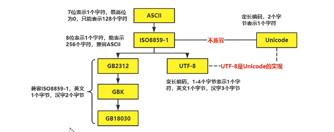
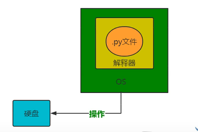
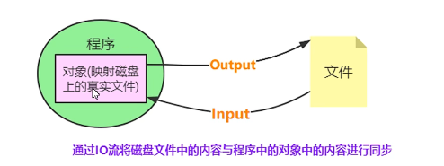
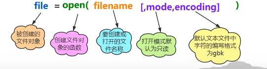
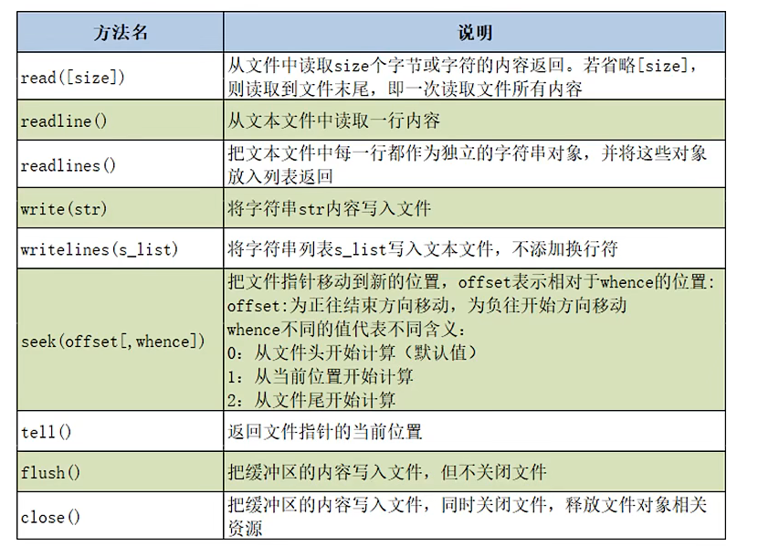
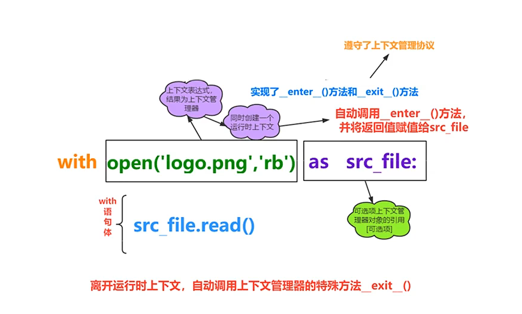

## Day17

---

## 编码格式的介绍

### 编码格式

* Python的解释器使用的是Unicode(内存)

* `.py`文件在磁盘上使用的是UTF-8存储(外存)



```python
#修改编码格式,在文件最初添加以下，默认utf-8
#encoding = gbk
```


---

## 文件的读写原理

* 文件的读写俗称"IO操作"

* 文件读写操作流程

  1. 打开文件：使用Python内置的open()函数打开文件，可以指定文件的路径、文件名、打开方式等参数。

  2. 读写文件：使用文件对象的read()、readline()、write()等方法读写文件内容。

  3. 关闭文件：使用文件对象的close()方法关闭文件，释放系统资源。

  以下是一个简单的Python文件读写示例：

  ```python
  # 打开文件
  file = open('test.txt', 'r')
  
  # 读取文件内容
  content = file.read()
  
  # 打印文件内容
  print(content)
  
  # 关闭文件
  file.close()
  
  # 打开文件
  file = open('test.txt', 'w')
  
  # 写入文件内容
  file.write('Hello, World!')
  
  # 关闭文件
  file.close()
  ```

  在这个示例中，首先使用open()函数打开名为test.txt的文件，并指定打开方式为'r'（只读模式），然后使用文件对象的read()方法读取文件内容，并打印出来。接着，再次打开test.txt文件，指定打开方式为'w'（写入模式），使用文件对象的write()方法向文件中写入'Hello, World!'，最后使用close()方法关闭文件。

* 操作原理

  

  

​		Python文件读写的具体实现原理是：当程序调用`open()`函数打开一个文件时，操作系统会根据文件名和路径查找文件并返回一个文		件对象。文件对象包含了文件的基本信息，如文件名、文件路径、文件大小、文件打开模式等。Python程序可以使用文件对象的方		法读写文件内容。

​		当程序调用文件对象的`read()`方法读取文件内容时，操作系统会将文件内容读入内存中，并返回给程序。程序可以使用读取到的文		件内容进行后续的处理。当程序调用文件对象的`write()`方法写入文件内容时，操作系统会将写入的内容缓存到内存中，并在适当的		时候将缓存中的内容写入到文件中。

​		当程序使用完文件后，应该使用文件对象的`close()`方法关闭文件。关闭文件时，操作系统会释放文件占用的资源，包括文件句柄、		缓存等。如果程序没有显式关闭文件，操作系统会在程序执行完毕后自动关闭文件。

​		总之，Python文件读写的操作原理是通过文件对象与操作系统进行交互来实现的，程序可以使用文件对象的方法读写文件内容，操		作系统会负责将文件内容读写到内存或磁盘中，并在适当的时候释放文件占用的资源。

## 文件的读写操作

* 内置函数`open()`创建文件对象

  

  

* 语法规则

  

```python
file = open('a.txt','r')
print(file.readlines())	#读取党建放进列表
file.close()
```

## 常用的文件打开模式

* 文件的类型
  * 按文件中数据的组织形式，文件分为以下两大类
    * **文本文件**：存储的是普通“字符"文本，默认为unicode字符集，可以使用记本事程序打开
    * **二进制文件**：把数据内容用“字节"进行存储，无法用记事本打开，必须使用专用的软件打开，举例：mp3音频文件，jpg图片，doc文档等

| 打开模式 | 描述                                                         |
| -------- | ------------------------------------------------------------ |
| r        | 以只读模式打开文件，文件的指针会放在文件的开头               |
| w        | 以只写模式打开文件，如果文件不存在则创建，如果文件存在，则覆盖原有内容，文件指针在文件的开头 |
| a        | 以追加模式打开文件，如果文件不存在则创建，文件指针在开头，如果问价存在，则在文件末尾追加内容，文件指针在源文件末尾 |
| b        | 以二进制方式打开文件，不能单独使用，需要与其他模式一起使用，rb,或者wb |
| +        | 以读写方式打开文件，不能单独使用，需要与其他模式一起使用，a+ |

###

Python中常用的文件打开模式有以下几种：

- `r`：只读模式，打开文件后只能读取文件内容，不能写入或修改文件。
- `w`：只写模式，打开文件后可以写入文件内容，如果文件已存在则会清空文件内容，如果文件不存在则会创建一个新的文件。
- `a`：追加模式，打开文件后可以写入文件内容，如果文件已存在则会在文件末尾追加内容，如果文件不存在则会创建一个新的文件。
- `x`：创建模式，创建一个新的文件并打开，如果文件已存在则会报错。
- `b`：二进制模式，打开文件时以二进制方式进行读写，适用于非文本文件（如图片、音频、视频等）。
- `t`：文本模式，打开文件时以文本方式进行读写，适用于文本文件。

以下是几个文件打开模式的例子：

```python
# 只读模式，打开一个名为test.txt的文件
file = open('test.txt', 'r')

# 只写模式，打开一个名为test.txt的文件，如果文件不存在则创建一个新的文件
file = open('test.txt', 'w')

# 追加模式，打开一个名为test.txt的文件，如果文件不存在则创建一个新的文件
file = open('test.txt', 'a')

# 创建模式，创建一个新的名为test.txt的文件
file = open('test.txt', 'x')

# 二进制模式，打开一个名为test.png的图片文件
file = open('test.png', 'rb')

# 文本模式，打开一个名为test.txt的文本文件
file = open('test.txt', 'rt')
```

在以上示例中，我们使用了不同的文件打开模式来打开文件，并创建了不同类型的文件对象。需要注意的是，使用完文件后应该使用文件对象的`close()`方法关闭文件，以释放文件占用的资源。

---

## 文件对象的常用方法



Python文件对象有很多常用的方法，以下是其中一些：

- `read(size=-1)`：读取文件内容，返回字符串或字节串。如果指定了`size`参数，则最多读取`size`个字符或字节，否则读取整个文件内容。示例：

  ```python
  # 读取整个文件内容
  file = open('test.txt', 'r')
  content = file.read()
  file.close()

  # 读取前10个字符
  file = open('test.txt', 'r')
  content = file.read(10)
  file.close()
  ```

- `readline(size=-1)`：读取文件的一行内容，返回字符串或字节串。如果指定了`size`参数，则最多读取`size`个字符或字节，否则读取整行内容。示例：

  ```python
  # 读取第一行内容
  file = open('test.txt', 'r')
  line = file.readline()
  file.close()

  # 读取前10个字符
  file = open('test.txt', 'r')
  line = file.readline(10)
  file.close()
  ```

- `readlines(hint=-1)`：读取文件的所有行，返回包含每行内容的字符串或字节串列表。如果指定了`hint`参数，则最多读取`hint`个字符或字节，否则读取所有行内容。示例：

  ```python
  # 读取所有行内容
  file = open('test.txt', 'r')
  lines = file.readlines()
  file.close()

  # 读取前100个字符
  file = open('test.txt', 'r')
  lines = file.readlines(100)
  file.close()
  ```

- `write(string)`：向文件写入字符串或字节串，返回写入的字符数或字节数。示例：

  ```python
  # 向文件写入字符串
  file = open('test.txt', 'w')
  file.write('Hello, world!')
  file.close()

  # 向文件写入字节串
  file = open('test.bin', 'wb')
  file.write(b'\x01\x02\x03')
  file.close()
  ```

- `writelines(lines)`：向文件写入多行内容，参数`lines`是包含每行内容的字符串或字节串列表。示例：

  ```python
  # 向文件写入多行内容
  file = open('test.txt', 'w')
  lines = ['Hello\n', 'world\n']
  file.writelines(lines)
  file.close()
  ```

- `seek(offset[, whence])`：移动文件指针到指定位置，参数`offset`是偏移量，参数`whence`是起始位置，可选值为0（文件开头）、1（当前位置）和2（文件结尾）。示例：

  ```python
  # 移动文件指针到文件开头
  file = open('test.txt', 'r')
  file.seek(0, 0)
  content = file.read()
  file.close()

  # 移动文件指针到文件结尾
  file = open('test.txt', 'a')
  file.seek(0, 2)
  file.write('Hello, world!')
  file.close()
  ```

- `tell()`：返回当前文件指针的位置。示例：

  ```python
  # 获取当前文件指针的位置
  file = open('test.txt', 'r')
  content = file.read()
  pos = file.tell()
  file.close()
  ```

以上是Python文件对象的一些常用方法及示例，可以根据实际需求选择合适的方法进行文件读写操作。


---

## with语句

* with语句可以自动管理上下文资源，不论什么原因跳出with块都能确保文件正确的关闭，以此来达到释放资源的目的



```python
with open('a.txt','r') as file:
    print(file.read())
    #不用手动close()
```

Python中的with语句用于自动管理资源，例如文件操作和网络连接等。它会在语句块开始前打开资源，在语句块结束时自动关闭资源，无论是正常结束还是发生异常。这种方式确保了资源在不再需要时能够正确关闭，避免了常见的资源泄漏问题。

以下是一个简单的例子，展示如何使用with语句来打开和关闭文件：

```python
with open('example.txt', 'r') as f:
    data = f.read()
    print(data)
```

在这个例子中，我们使用`open`函数打开一个名为`example.txt`的文件。使用`with`语句，我们将文件对象赋值给变量`f`。在语句块中，我们可以使用`f`对象读取文件内容并打印它。当语句块结束时，Python会自动关闭文件，释放资源。

在实际应用中，with语句可以用于许多不同的资源管理场景，例如数据库连接、网络连接、线程锁等。无论是什么资源，使用with语句都可以确保资源在不再需要时被正确关闭和释放。

### 上下文管理器

Python的上下文管理器是一种实现了`__enter__`和`__exit__`方法的对象，用于管理代码块的执行上下文。上下文管理器可以确保资源在代码块执行结束时被正确地关闭或清理。

当一个对象被作为上下文管理器使用时，它的`__enter__`方法会在代码块执行前被调用，`__exit__`方法会在代码块执行结束后被调用。在执行代码块期间，上下文管理器可以执行一些初始化或清理操作，例如打开和关闭文件、获取和释放锁等。

下面是一个简单的例子，展示如何使用上下文管理器来管理文件操作：

```python
class File:
    def __init__(self, filename, mode):
        self.filename = filename
        self.mode = mode
    
    def __enter__(self):
        self.file = open(self.filename, self.mode)
        return self.file
    
    def __exit__(self, exc_type, exc_value, traceback):
        self.file.close()

with File('example.txt', 'r') as f:
    data = f.read()
    print(data)
```

在这个例子中，我们定义了一个名为`File`的类，它实现了上下文管理器的`__enter__`和`__exit__`方法。在`__enter__`方法中，我们打开文件并返回文件对象。在`__exit__`方法中，我们关闭文件。使用`with`语句，我们将文件对象赋值给变量`f`，在语句块中使用它来读取文件内容并打印它。当语句块结束时，Python会自动调用`__exit__`方法关闭文件。

除了使用类来实现上下文管理器外，Python还提供了`contextlib`模块，它包含了一些用于创建上下文管理器的实用函数和装饰器。使用`contextlib`模块，我们可以更方便地创建和使用上下文管理器。


---

## os模块的常用函数

* os模块是Python内置的与操作系统功能和文件系统相关的模块，该模块中的语句的执行结果通常与操作系统有关，在不同的操作系统上运行，得到的结果可能不一样。
* os模块与os.path模块用于对目录或文件进行操作

```python
import os
os.system('notepad.exe')
os.system('calc.exe')
#直接调用可执行文件
os.startfile('文件路径\\**.exe')	#双反斜杠，转义\
```

| 函数名                            | 描述                               |
| --------------------------------- | ---------------------------------- |
| **`os.getcwd()`**                 | 获取当前工作目录                   |
| **`os.chdir(path)`**              | 设置当前工作目录为指定路径         |
| **`os.listdir(path)`**            | 返回指定路径下的文件和目录列表     |
| **`os.mkdir(path)`**              | 创建一个新目录                     |
| **`os.makedirs(path)`**           | 递归创建一个新目录                 |
| **`os.rmdir(path)`**              | 删除指定目录（只能删除空目录）     |
| **`os.removedirs(path)`**         | 递归删除指定目录及其所有子目录     |
| `os.rename(src, dst)`             | 将文件或目录从src重命名为dst       |
| `os.remove(path)`                 | 删除指定文件                       |
| `os.path.abspath(path)`           | 返回指定路径的绝对路径             |
| `os.path.basename(path)`          | 返回指定路径的文件名或目录名       |
| `os.path.dirname(path)`           | 返回指定路径的父目录               |
| `os.path.exists(path)`            | 判断指定路径是否存在               |
| `os.path.isfile(path)`            | 判断指定路径是否为文件             |
| `os.path.isdir(path)`             | 判断指定路径是否为目录             |
| `os.path.join(path1, path2, ...)` | 将多个路径组合成一个新路径         |
| `os.path.split(path)`             | 将指定路径分割成目录和文件名两部分 |

以上是一些常用的os模块操作目录相关函数及其描述。可以使用这些函数来管理和操作文件和目录。

以下是常见的一些Python中的os模块操作目录相关函数及其例子：

1. `os.getcwd()`：获取当前工作目录

```python
import os

current_dir = os.getcwd()
print("当前工作目录：", current_dir)
```

2. `os.chdir(path)`：设置当前工作目录为指定路径

```python
import os

os.chdir('/Users/username/Desktop')
print("当前工作目录：", os.getcwd())
```

3. `os.listdir(path)`：返回指定路径下的文件和目录列表

```python
import os

dir_list = os.listdir('/Users/username/Desktop')
for item in dir_list:
    print(item)
```

4. `os.mkdir(path)`：创建一个新目录

```python
import os

os.mkdir('/Users/username/Desktop/NewFolder')
```

5. `os.rmdir(path)`：删除指定目录（只能删除空目录）

```python
import os

os.rmdir('/Users/username/Desktop/NewFolder')
```

6. `os.rename(src, dst)`：将文件或目录从src重命名为dst

```python
import os

os.rename('/Users/username/Desktop/old_name.txt', '/Users/username/Desktop/new_name.txt')
```

7. `os.remove(path)`：删除指定文件

```python
import os

os.remove('/Users/username/Desktop/test.txt')
```

8. `os.path.abspath(path)`：返回指定路径的绝对路径

```python
import os

absolute_path = os.path.abspath('test.txt')
print(absolute_path)
```

9. `os.path.exists(path)`：判断指定路径是否存在

```python
import os

path = '/Users/username/Desktop/test.txt'
if os.path.exists(path):
    print("文件存在")
else:
    print("文件不存在")
```

以上是一些常用的os模块操作目录相关函数的例子。这些函数可以帮助我们管理和操作文件和目录。


---

## path模块操作目录相关函数

| 函数名                             | 描述                               | 示例                                                         |
| ---------------------------------- | ---------------------------------- | ------------------------------------------------------------ |
| **`path.join(path1, path2, ...)`** | 将多个路径组合成一个新路径         | `os.path.join('/Users', 'username', 'Desktop')` 返回 `/Users/username/Desktop` |
| **`path.abspath(path)`**           | 返回指定路径的绝对路径             | `os.path.abspath('test.txt')` 返回 `/Users/username/Desktop/test.txt` |
| **`path.basename(path)`**          | 返回指定路径的文件名或目录名       | `os.path.basename('/Users/username/Desktop/test.txt')` 返回 `test.txt` |
| **`path.dirname(path)`**           | 返回指定路径的父目录               | `os.path.dirname('/Users/username/Desktop/test.txt')` 返回 `/Users/username/Desktop` |
| **`path.exists(path)`**            | 判断指定路径是否存在               | `os.path.exists('/Users/username/Desktop/test.txt')` 返回 `True` 或 `False` |
| `path.isfile(path)`                | 判断指定路径是否为文件             | `os.path.isfile('/Users/username/Desktop/test.txt')` 返回 `True` 或 `False` |
| **`path.isdir(path)`**             | 判断指定路径是否为目录             | `os.path.isdir('/Users/username/Desktop')` 返回 `True` 或 `False` |
| **`path.split(path)`**             | 将指定路径分割成目录和文件名两部分 | `os.path.split('/Users/username/Desktop/test.txt')` 返回 `('/Users/username/Desktop', 'test.txt')` |

以上是Python中path模块操作目录相关函数的详细说明以及示例。这些函数可以帮助我们更好地操作和管理文件和目录。


### 课堂案例-列出指定目录下的`.py`文件

```python
import os
path = os.getcwd()
lst = os.listdir(path)
for filename in lst:	#获取所有.py文件
    if  filename.endswith('.py'):
		print(filename)
```

### 补充-os.walk()

`os.walk()`是Python中的一个函数，用于遍历一个目录及其子目录中的所有文件和文件夹。它返回一个生成器对象，可以迭代获得当前目录、子目录和文件的路径信息。

以下是`os.walk()`函数的语法：

```python
for root, dirs, files in os.walk(top, topdown=True, onerror=None, followlinks=False):	#得到一个元组
    # 处理当前目录的代码
    for name in dirs:
        # 处理当前目录中的子目录的代码
    for name in files:
        # 处理当前目录中的文件的代码
```

- `top`：需要遍历的目录路径。
- `topdown`：遍历的顺序，默认为从上到下。
- `onerror`：遍历出错时的处理方式，默认为抛出异常。
- `followlinks`：是否遍历符号链接指向的路径，默认为不遍历。

以下是一个使用`os.walk()`遍历目录的示例：

```python
import os

root_path = '/Users/username/Desktop'
for root, dirs, files in os.walk(root_path):
    # 打印当前目录路径
    print('当前目录：', root)
    # 打印当前目录中的子目录名
    print('子目录：', dirs)
    # 打印当前目录中的文件名
    print('文件：', files)
```

以上代码会遍历`/Users/username/Desktop`目录及其子目录中的所有文件和文件夹，并打印它们的路径信息。
