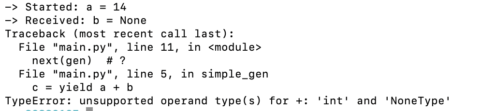

## yield

简单来说，你可以把`yield`当成`return`，但它返回的是一个生成器。 记住，刚开始学习的时候不需要了解这个`yield`是什么，但是一定要了解它的运行机制！ 让我们看一下下面的代码片段：

```
def test():
    print("First")
    yield 1
    print("Second")
    yield 2
    print("Third")
    yield 3

my_generator = test() # 创建生成器
print(type(my_generator)) # <class 'generator'>
```

我们可以在这里看到如果一个函数使用 `yield` 作为返回值，那么它就变成了一个生成器函数。 与普通函数不同，生成器函数被调用后，函数体中的代码不会立即执行（执行my_generator=test()后不打印任何值），而是返回一个生成器！正如我们前面提到的：`generator` 是迭代器，而 `yield` 可以被视为 `return` ，不难猜测下面代码的结果：

```
def test():

    print("First")
    yield 1
    print("Second")
    yield 2
    print("Third")
    yield 3

for item in test():
    print(item)
    
# 输出：
"""
First
1
Second
2
Third
3
"""
```

`next` 函数是如何运行的？


```python
def test():
    print("First")
    yield 1
    print("Second")
    yield 2
    print("Third")
    yield 3
my_generator = test() # 创建生成器
a = next(my_generator) # First
print(a) # 1
b = next(my_generator) # Second
print(b) # 2
c = next(my_generator) # Third
print(c) # 3
d = next(my_generator) # StopIteration
print(d) # error
```

每次调用`next(my_generator`)，只跑到`yield`位置就停止，下次再跑，从上次结束的位置开始！并且生成器的长度取决于在函数中定义 `yield` 的次数。看起来也很好理解呢。

如果理解了上面的 `yield` 函数示例，让我们继续看一个更复杂的示例，该生成器可以接受参数。

```python
def simple_gen(a):
    print('-> Started: a =', a)
    b = yield a
    print('-> Received: b =', b)
    c = yield a + b
    print('-> Received: c =', c)
    gen = simple_gen(14)
    next(gen) # -> Started: a = 14
    next(gen) # ？
    next(gen) # ？
```

运行结果如图：



发生了什么？？从第一次 `next(gen)` 调用开始，它在 `yield a` 处停止，然后当您再次调用 `next(gen)` 时，`b` 实际上是 `None` 值，这导致了异常。

`b` 为什么是 `None` 值？因为我们在 `yield a` 处没有接收到任何值，所以 `b` 就是 `None` 值。要想接收值，

要继续，您需要使用 `send()` 函数：生成器发送（值）恢复执行并将值“发送”到生成器函数中。 `value` 参数成为当前 `yield` 表达式的结果。 `send()` 方法返回生成器生成的下一个值，或者如果生成器退出而没有生成另一个值则引发 `StopIteration`。

怎么理解`send()` 函数？一个带参数的 `next()`，接收参数，执行`yield`，然后返回值。

```python
def simple_gen(a):
    print('-> Started: a =', a)
    b = yield a
    print('-> Received: b =', b)
    c = yield a + b
    print('-> Received: c =', c)
    gen = simple_gen(14)
    next(gen) # -> Started: a = 14
    gen.send(15) # Received: b = 15 # send 15 to generator，并执行下一步 send包含next的yield
```
