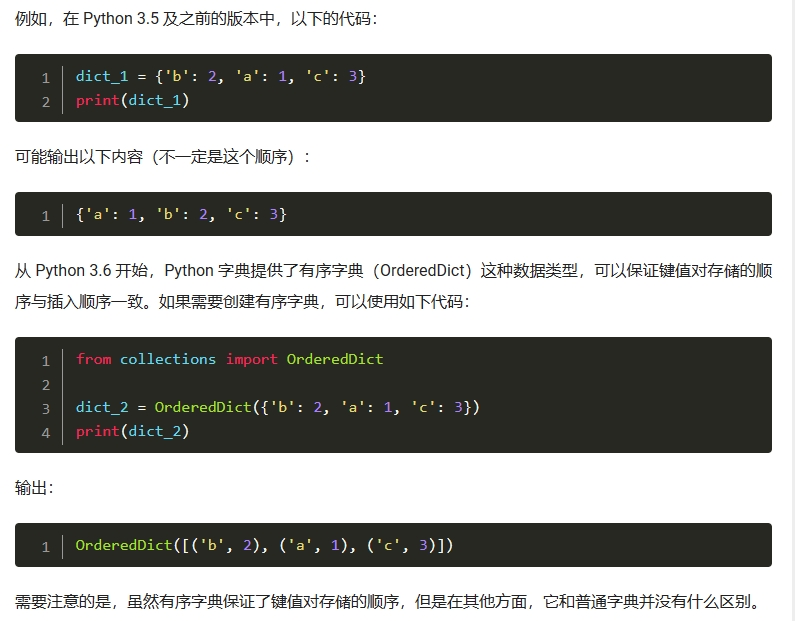

## 字典是无序的，但也可以创建有序的字典




在Python中，你可以使用`collections`模块中的`OrderedDict`类来创建有序字典。`OrderedDict`类继承自内置字典类型`dict`，它会记住字典中元素的插入顺序。

下面是创建有序字典的示例：

```python
from collections import OrderedDict

# 创建一个空的有序字典
ordered_dict = OrderedDict()

# 添加键值对
ordered_dict["a"] = 1
ordered_dict["b"] = 2
ordered_dict["c"] = 3

print(ordered_dict)
# 输出: OrderedDict([('a', 1), ('b', 2), ('c', 3)])

# 遍历有序字典
for key, value in ordered_dict.items():
    print(key, value)
# 输出:
# a 1
# b 2
# c 3
```


在上述示例中，我们首先导入`OrderedDict`类。然后，我们创建一个空的有序字典`ordered_dict`。接着，我们使用`ordered_dict[key] = value`的语法向有序字典添加键值对。注意，添加的顺序将被保留。

最后，我们可以通过`print(ordered_dict)`来查看有序字典的内容。我们还可以使用`for`循环来遍历有序字典并输出键和值。

需要注意的是，从Python 3.7开始，内置的`dict`类也开始保持元素的插入顺序。因此，如果你在Python 3.7或更高版本中使用内置的`dict`类，并且不需要`OrderedDict`所特有的功能，你可以直接使用内置的`dict`来创建有序字典。