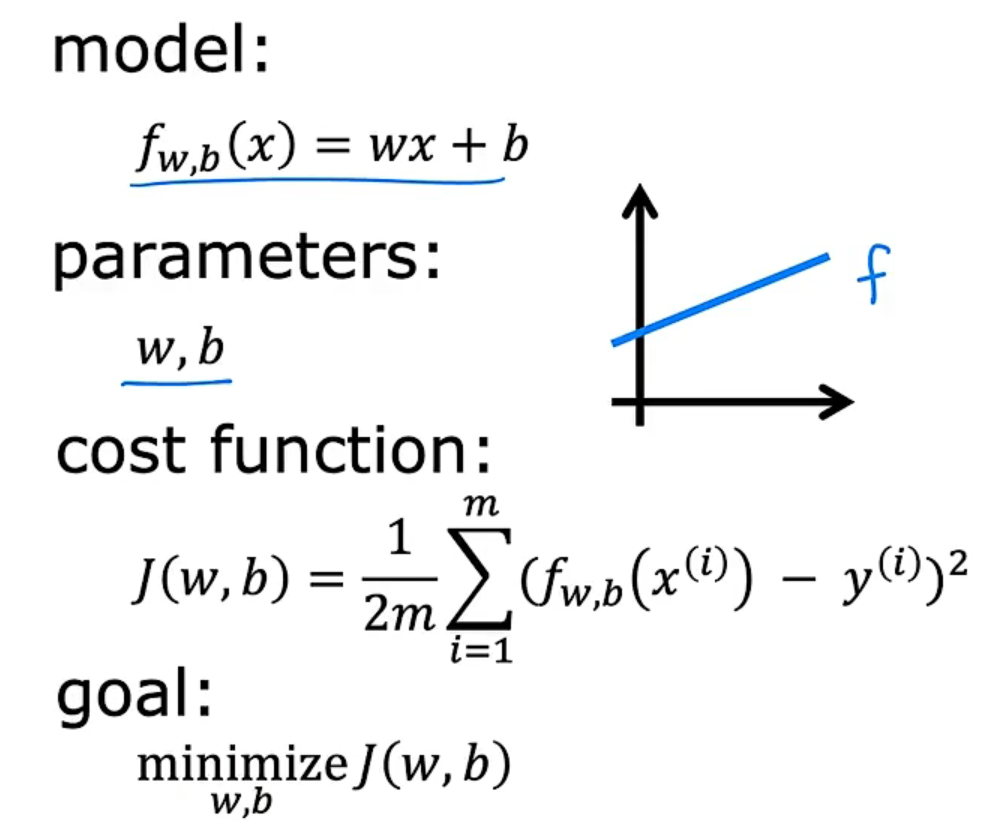

## Day01

---

## 监督学习

监督学习是机器学习中最常用的方法之一，它是指<u>通过给算法提供已标记的数据</u>来训练模型，让模型能够学习到**输入和输出**之间的关系。在监督学习中，我们将数据集分为两部分：**训练集和测试集**。训练集用于训练模型，测试集用于测试模型的性能。

* 监督学习可以分为**分类和回归**两种类型。

分类是指将输入数据分为不同的类别，如垃圾邮件分类、图像识别等。回归是指预测一个连续的数值，如股票价格预测、房价预测等。

监督学习的算法包括决策树、支持向量机、神经网络、朴素贝叶斯等。不同的算法适用于不同的问题和数据类型。在选择算法时，需要考虑算法的复杂度、准确度、可解释性等因素。

监督学习的优点是能够利用已有的数据来训练模型，可以得到较高的准确度。但是，监督学习也有一些限制，如需要大量标记好的数据、对数据的质量要求较高等。因此，在实际应用中，需要根据具体情况选择合适的学习方法。

---

## 无监督学习

无监督学习是机器学习中的一种方法，与监督学习不同，它<u>不需要标记好的数据，而是通过对数据的统计特征和结构的分析来学习模型</u>。无监督学习的目的是发现数据中的模式和结构，例如聚类、降维、异常检测等。

* 聚类是无监督学习中最常见的任务之一，它是将数据集中的样本分成若干个类别，使得同一类别中的样本相似度较高，不同类别中的样本相似度较低。常见的聚类算法有K-Means、层次聚类等。

* 降维是另一个常见的无监督学习任务，它是将高维数据映射到低维空间中，以便更好地进行可视化和分析。常见的降维算法有主成分分析（PCA）、独立成分分析（ICA）等。

* 异常检测是另一种无监督学习任务，它是检测数据集中的异常样本，例如金融欺诈检测、网络入侵检测等。

无监督学习的优点是不需要标记好的数据，可以处理大规模的数据集，发现数据中的潜在模式和结构。但是，由于缺乏标记信息，无法直接评估模型的性能，因此需要通过其他方式来验证模型的效果。

总之，无监督学习是机器学习中重要的一部分，它可以帮助我们更好地理解数据，并为其他任务提供支持。

---

## 监督学习模型

下面我将对监督学习中常用的模型进行详细的说明：

1. 线性回归模型 (Linear Regression)
线性回归是一种用于建立输入特征和输出变量之间线性关系的方法。其基本思想是，用线性方程拟合数据集，使得预测结果与真实结果的误差最小化。线性回归广泛应用于预测、分类和回归分析等领域。

2. 逻辑回归模型 (Logistic Regression)
逻辑回归是一种广义线性回归模型，主要用于二元分类问题。其基本思想是将输入特征与一个Sigmoid函数相结合，将输出转换为0或1的概率值。逻辑回归适用于各种分类问题，例如医学诊断、信用评估等。

3. 决策树模型 (Decision Tree)
决策树是一种基于树形结构的分类模型，通过分析训练数据集中的特征来构建一个决策树模型。该模型通过树的分支来决定样本所属的类别。决策树适用于多分类和回归问题，如金融风险评估和医学诊断。

4. 支持向量机模型 (Support Vector Machine, SVM)
支持向量机是一种广泛应用于分类和回归问题的模型。其基本思想是通过一个超平面将样本分成不同的类别。在支持向量机模型中，将训练数据集投影到高维空间，以便在空间中更容易分割样本。支持向量机适用于高维空间的分类问题，如文本分类、图像分类等。

5. 随机森林模型 (Random Forest)
随机森林是一种基于决策树的集成学习模型。它通过对多个决策树的输出结果进行投票来确定最终的分类结果。随机森林适用于分类和回归问题，如金融风险评估和医学诊断。

6. 神经网络模型 (Neural Network)
神经网络是一种通过人工神经元构建的复杂计算模型。它通过多层神经元来学习复杂的特征并进行分类。神经网络适用于各种分类和回归问题，如图像分类和自然语言处理。

以上是常用的监督学习模型及其说明，当然还有其他的模型和算法可以用于解决不同的问题。在选择使用哪个模型时，需要根据问题的特点和数据集的特征

### 线性回归模型---训练集

在机器学习中，训练集（Training Set）指的是用于训练模型的数据集合。训练集通常是一个已经被标注（Label）的数据集合，其中每个数据点都包含了多个特征（Feature）和对应的标注。

训练集的目的是用于训练机器学习模型，使其能够学习到特征与标注之间的关系，并能够在给定新的特征时预测对应的标注。在训练过程中，机器学习模型会根据训练集中的数据点不断调整自身的参数，以使得其预测结果与标注更加接近。

通常情况下，一个好的训练集应该包含足够的数据点以覆盖所有可能的输入情况，且每个数据点应该能够准确地反映出真实世界中的特征与标注之间的关系。同时，训练集也需要与应用场景密切相关，以确保机器学习模型在实际应用时能够表现出良好的性能。

#### 字母含义

在机器学习中，通常将数据集分成训练集、验证集和测试集三部分。训练集是用来训练模型的数据集，包含了模型需要学习的特征和标签。在训练集中，通常会使用一些字母来表示不同的含义，例如：

- X：特征矩阵，通常表示输入数据的属性或特征。
- y：标签向量，通常表示输出数据的分类或回归结果。
- N：样本数量，通常表示训练集中包含的样本数量。
- d：特征数量，通常表示每个样本包含的特征数量。
- xi：第i个样本的特征向量，通常表示训练集中第i个样本的所有属性或特征。
- yi：第i个样本的标签，通常表示训练集中第i个样本的分类或回归结果。

这些符号的含义可以根据具体的问题和算法而有所不同，但是通常遵循类似的命名规范，以便于交流和理解。

#### $f(x) = wx + b$ 

$f(x) = wx + b$ 是线性回归模型中的函数公式，其中 $w$ 是权重（也称为系数），$b$ 是偏差（也称为截距），$x$ 是输入特征。该模型的主要目的是找到一条直线，使得输入特征 $x$ 对应的输出 $f(x)$ 尽可能接近真实值 $y$。

在训练模型时，我们使用训练数据集来确定模型的权重和偏差。这通常涉及到最小化损失函数，比如均方误差（MSE）或平均绝对误差（MAE），以使模型的预测值和实际值的差异最小化。

当模型训练好后，我们可以使用它来进行预测。给定一个输入特征 $x$，我们可以通过将其带入函数 $f(x)$ 来计算输出值 $y$。

#### 代价函数

代价函数是指机器学习中用于衡量模型预测结果与实际结果差距的函数，通常也称为损失函数或误差函数。在线性回归模型中，常用的代价函数是均方误差（Mean Squared Error，MSE）。

均方误差的公式如下：

$$ J(w,b) = \frac{1}{2m}\sum_{i=1}^m(h_w(x^{(i)})-y^{(i)})^2 $$

其中，$m$ 是样本数量，$h_w(x)$ 是模型的预测值(即 y hat)，$y$ 是实际值。$w$ 和 $b$ 分别是模型的权重和偏置项。

代价函数的作用是用来评估模型的预测效果，如果代价函数值越小，说明模型的预测效果越好。通常使用梯度下降等优化算法来最小化代价函数，从而得到最优的模型参数 $w$ 和 $b$。

在机器学习中，我们使用梯度下降算法来找到代价函数的最小值，从而找到最优的 $w$ 和 $b$。梯度下降算法的基本思想是通过计算代价函数对于 $w$ 和 $b$ 的偏导数，找到代价函数下降最快的方向，并沿着该方向逐步迭代调整 $w$ 和 $b$ 的值，直到代价函数达到最小值。

具体而言，梯度下降算法通过反复执行以下两个步骤来更新 $w$ 和 $b$ 的值：

1. 计算代价函数 $J(w,b)$ 对于 $w$ 和 $b$ 的偏导数：

$$\frac{\partial J(w,b)}{\partial w}=\frac{1}{m}\sum_{i=1}^m (y^{(i)}-\hat{y}^{(i)})x^{(i)}$$

$$\frac{\partial J(w,b)}{\partial b}=\frac{1}{m}\sum_{i=1}^m (y^{(i)}-\hat{y}^{(i)})$$

其中，$m$ 是样本数量，$y^{(i)}$ 是第 $i$ 个样本的真实值，$\hat{y}^{(i)}$ 是第 $i$ 个样本的预测值，$x^{(i)}$ 是第 $i$ 个样本的特征向量。

2. 更新 $w$ 和 $b$ 的值：

$$w:=w-\alpha\frac{\partial J(w,b)}{\partial w}$$

$$b:=b-\alpha\frac{\partial J(w,b)}{\partial b}$$

其中，$\alpha$ 是学习率，表示每次迭代更新的步长。学习率的选择对于梯度下降算法的收敛速度和效果有很大的影响，一般需要进行调参。
