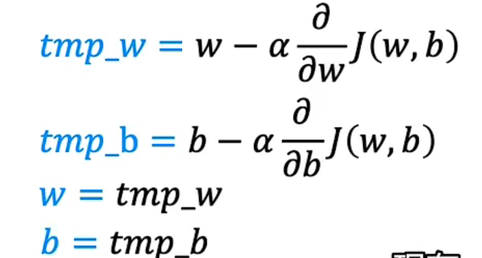
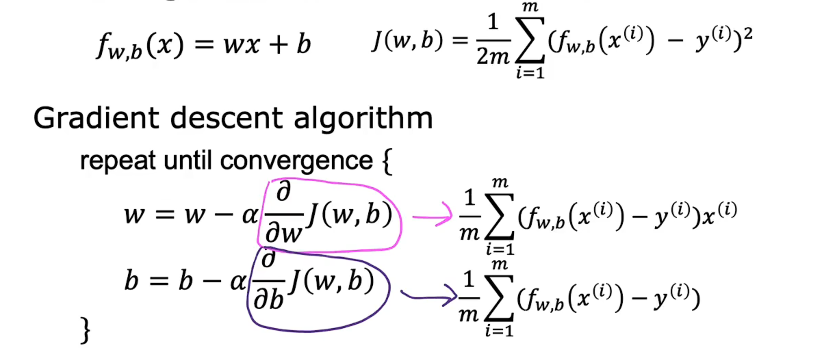

## Day02

## 梯度下降

梯度下降是一种常用的优化算法，它在机器学习中被广泛应用。其基本思想是通过不断地调整模型参数来最小化损失函数，从而使得模型的预测结果更加准确。

在梯度下降中，我们首先需要定义一个损失函数，它用来衡量模型的预测结果与实际值之间的差距。我们的目标是最小化这个损失函数。为了实现这个目标，我们需要计算损失函数对模型参数的梯度，也就是损失函数在当前模型参数处的斜率。然后，我们以此为依据，调整模型参数的值，使得损失函数最小化。

具体来说，梯度下降算法的步骤如下：

1. 初始化模型参数，例如权重和偏置。

2. 计算损失函数关于模型参数的梯度。

3. 更新模型参数的值，使得损失函数最小化。

4. 重复步骤2和3，直到损失函数收敛于最小值。

需要注意的是，梯度下降算法有两种不同的方式：批量梯度下降和随机梯度下降。批量梯度下降是指在每次更新模型参数时，使用全部的训练数据计算梯度；而随机梯度下降是指在每次更新模型参数时，只使用一个样本的数据计算梯度。两种方式各有优缺点，需要根据具体的问题来选择。

### 梯度下降的实现

梯度下降是一种常用的优化算法，用于求解最小化代价函数的最优参数。其基本思路是通过迭代更新参数，使代价函数不断减小。梯度下降算法的实现公式如下：

$w_j = w_j - \alpha \frac{\partial J(w)}{\partial w_j}$

其中，$w_j$是参数向量中的第$j$个元素，$\alpha$是学习率（learning rate），控制每次更新的步长大小，$J(w)$是代价函数，$\frac{\partial J(w)}{\partial w_j}$是代价函数对第$j$个参数的偏导数。

具体地，梯度下降算法的步骤如下：

1. 初始化参数向量$w$和学习率$\alpha$。
2. 计算代价函数$J(w)$在当前参数向量$w$处的值。
3. 计算代价函数$J(w)$对参数向量$w$中每个元素的偏导数。
4. 根据公式$w_j = w_j - \alpha \frac{\partial J(w)}{\partial w_j}$，更新参数向量$w$。
5. 重复步骤2-4，直到满足停止条件（如达到一定的迭代次数或代价函数的值变化很小）。

需要注意的是，梯度下降算法的成功与否与学习率的选择有关。如果学习率过小，算法收敛速度慢；如果学习率过大，算法可能会发散。因此，在实际使用中需要根据具体问题选择合适的学习率。

* 

梯度下降算法的实现需要对参数 $w$ 和 $b$ 同时更新。设学习率为 $\alpha$，代价函数为 $J(w,b)$，则梯度下降算法的参数更新公式为：

$$w := w - \alpha\frac{\partial J(w,b)}{\partial w}$$

$$b := b - \alpha\frac{\partial J(w,b)}{\partial b}$$

其中，$\frac{\partial J(w,b)}{\partial w}$ 和 $\frac{\partial J(w,b)}{\partial b}$ 分别是代价函数 $J(w,b)$ 对 $w$ 和 $b$ 的偏导数，表示在当前 $w$ 和 $b$ 取值下，代价函数 $J(w,b)$ 变化最快的方向。梯度下降算法的主要思想是沿着负梯度方向逐步更新参数，使代价函数不断减小，最终达到收敛的状态。

### 学习率

学习率是梯度下降算法中一个重要的超参数，用于控制每次更新参数的步长。学习率通常用符号 α 表示，它的值需要根据具体的数据集和模型进行调整。如果学习率过小，则会导致收敛速度慢，需要更多的迭代次数才能达到收敛；而如果学习率过大，则会导致算法在最优点附近震荡，甚至无法收敛。

一般来说，可以从较小的学习率开始尝试，然后根据损失函数的下降速度逐步调整学习率的大小，以取得较快的收敛速度和较好的收敛效果。常用的学习率调整方法包括学习率衰减、自适应学习率、动量等技巧。

### 用于线性回归的梯度下降

