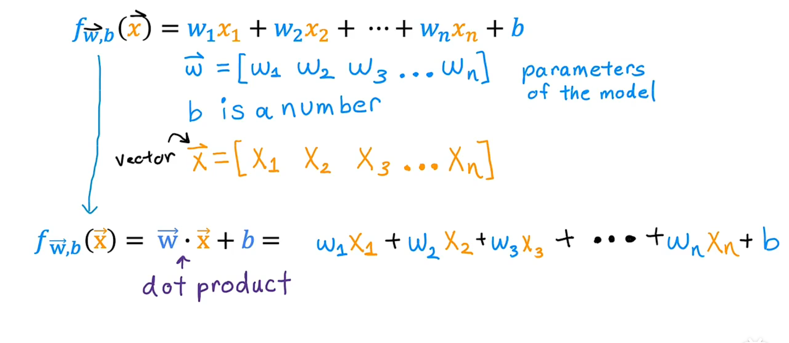
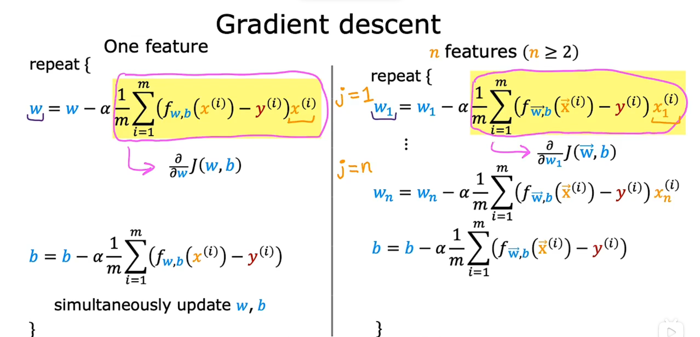

## Day03

## 多元线性方程

在机器学习中，多维特征指的是样本数据具有多个特征（属性）值。如果用$x_{1}, x_{2}, ..., x_{n}$表示一个样本的各个特征值，那么该样本就是一个n维特征向量，即$x = (x_{1}, x_{2}, ..., x_{n})$。

在机器学习中，通常使用线性模型来描述特征与输出之间的关系，其中$w = (w_{1}, w_{2}, ..., w_{n})$是特征的权重向量，$b$是偏置项（也称截距），特征向量$x$和$w$的点积加上偏置项$b$就可以表示样本的输出值：

$$y = w^{T}x + b = w_{1}x_{1} + w_{2}x_{2} + ... + w_{n}x_{n} + b$$

其中，$w^{T}$表示$w$的转置。该公式描述了一个线性回归模型，其中$w$和$b$需要通过学习来确定。



## 向量化

在机器学习中，向量化是一种优化方法，通过使用向量和矩阵运算代替循环来加速计算。向量化的思想可以用于线性回归、逻辑回归、神经网络等各种机器学习算法。

```python
w = np.array([1.0,2.5,3.3])
b = 4
x = np.array([10,20,30])
```

```python
# 实现推导优化
f = w[0] * x[0] + w[1] * x[1] + w[2] * x[2] + b

f = 0
for j in range(0,n):
    f = f + w[j] * x[j]
f = f + b


f = np.dot(w,x) + b
```


举个例子，假设有两个向量x和y，它们的长度都是n。如果要计算它们的点积，可以使用循环：

```python
dot = 0
for i in range(n):
    dot += x[i] * y[i]
```

但是，这个循环会随着n的增加而变得越来越慢。为了加速计算，可以使用`numpy`库提供的向量化运算：

```python
import numpy as np

dot = np.dot(x, y)
```

这样就可以避免使用循环，从而大大提高了计算效率。

除了点积之外，向量化还可以应用于矩阵乘法、逐元素运算等各种运算。通过向量化，我们可以更快、更简单地实现各种机器学习算法，提高代码的效率和可读性。

### NumPy

NumPy（Numerical Python）是Python科学计算的基础库之一，它提供了许多高性能的多维数组和矩阵运算功能，可以用来存储和处理大型矩阵和数组，是数据科学和机器学习中必不可少的库之一。

以下是NumPy的一些主要特点：

1. 多维数组：NumPy的核心是 `ndarray`，即多维数组，可以进行高效的元素级计算。 `ndarray`可以是一维数组、二维数组，甚至是更高维的数组。 `ndarray`提供了很多函数，如矩阵乘法、转置、线性代数等，可以方便地进行数学运算。

2. 广播：NumPy中的广播是指不同形状的数组之间的算术运算的行为，它使得NumPy的运算更加灵活和高效。

3. 数学函数：NumPy提供了许多数学函数，如三角函数、指数函数、对数函数等，可以直接应用于 `ndarray`数组，方便地进行各种数学运算。

4. 文件读写：NumPy提供了方便的文件读写功能，可以读写文本文件、二进制文件和csv文件等。

5. 科学计算：NumPy还提供了许多科学计算函数，如插值、傅里叶变换、优化、信号处理等。

6. 随机数生成：NumPy中提供了伪随机数生成器，可以生成各种分布的随机数序列。

NumPy的重要性在于它提供了一个高效的数组对象，以及许多针对数组的运算和数学函数。这使得NumPy成为了数据科学、统计学和机器学习等领域中不可或缺的工具之一。

---

## 多元线性回归的梯度下降

当进行多元线性回归时，我们希望找到一组权重向量 w 和一个偏置项 b，以最小化模型预测值与实际观测值之间的误差。梯度下降法可以用来逐步更新 w 和 b，以达到最小化误差的目标。

首先，定义模型的预测函数为：


其中， 表示模型的预测值，X 是特征矩阵，w 是权重向量，b 是偏置项。

我们使用均方误差（MSE）作为损失函数，定义为：


其中，m 是样本数量， 是第 i 个样本的预测值， 是实际观测值。

梯度下降的更新规则如下：


其中， 是学习率，决定每次更新的步长。

对于权重向量 w 的更新，可以通过对损失函数  求偏导数得到：


对于偏置项 b 的更新，可以简化为：


将上述公式向量化，可以写成以下形式：


这样，我们可以同时更新 w 和 b。

在实际应用中，通常会使用迭代的方式多次执行上述更新步骤，直到达到收敛条件或达到最大迭代次数。

需要注意的是，为了确保梯度下降方法的收敛性，通常需要对特征进行标准化处理，以防止不同特征之间的尺度差异对更新过程产生较大影响。此外，选择适当的学习率也很重要，过大的学习率可能导致算法发散，而过小的学习率可能导致收敛速度过慢。

以上是多元线性回归中使用梯度下降法进行权重和偏置项更新的公式和向量化表示。在实际应用中，我们可以根据具体的问题和数据特点来调整学习率、收敛条件等参数，以获得最佳的模型拟合效果。




多元线性回归的梯度下降法是一种常用的优化算法，用于求解多个自变量的线性回归模型的最优参数。下面是多元线性回归的梯度下降法的基本步骤：

1. 准备数据：收集多个自变量和对应的因变量的数据样本。

2. 初始化参数：选择初始的模型参数（权重）值。

3. 定义损失函数：根据多元线性回归模型的定义，定义一个损失函数，通常使用均方误差（MSE）作为损失函数。

4. 计算梯度：计算损失函数对每个参数的偏导数，得到梯度向量。

5. 更新参数：根据梯度和学习率（步长）的大小，更新模型参数。

6. 迭代优化：重复步骤4和步骤5，直到达到停止条件（如达到最大迭代次数或损失函数收敛）。

下面是使用梯度下降法实现多元线性回归的简单示例代码：

```python
import numpy as np

def gradient_descent(X, y, learning_rate, num_iterations):
    num_samples, num_features = X.shape
    theta = np.zeros((num_features, 1))
    m = num_samples

    for i in range(num_iterations):
        predictions = np.dot(X, theta)
        errors = predictions - y
        gradient = (1/m) * np.dot(X.T, errors)
        theta -= learning_rate * gradient

    return theta

# 假设有3个自变量和1个因变量
X = np.array([[1, 2, 3], [4, 5, 6], [7, 8, 9]])
y = np.array([[10], [20], [30]])

learning_rate = 0.01
num_iterations = 1000

theta = gradient_descent(X, y, learning_rate, num_iterations)
print("最优参数：")
print(theta)
```

在上述示例中，我们定义了一个 `gradient_descent` 函数，接受输入数据 `X` 和目标值 `y`，以及学习率和迭代次数作为参数。函数内部通过梯度下降法迭代更新参数 `theta`，最终返回优化后的最优参数。

这只是一个简单的示例，实际应用中可能需要对数据进行预处理、添加截距项、进行特征缩放等操作。同时，还需要注意学习率的选择，过大或过小的学习率可能导致算法无法收敛或收敛速度过慢。