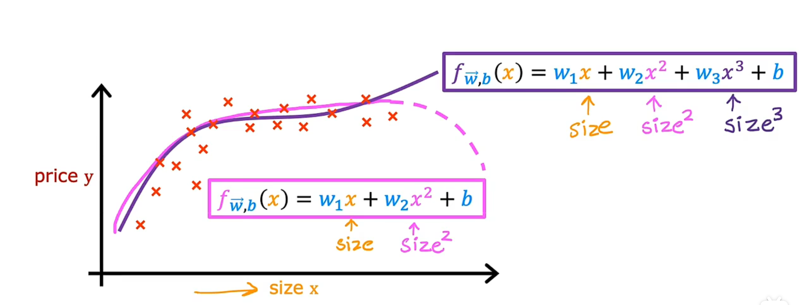

## Day04

## 特征缩放

特征缩放（Feature Scaling）是指对输入特征进行线性变换，将其映射到特定的范围或分布中，以便更好地适应机器学习算法的需求。特征缩放的目的是消除不同特征之间的尺度差异，确保它们具有相近的数值范围，从而避免某些特征对模型训练的影响过大。

常用的特征缩放方法包括：

1. 标准化（Standardization）：将特征按照其均值和标准差进行线性变换，使得特征的均值为0，标准差为1。标准化公式如下：

   

   其中，X 是原始特征，X_标准化 是标准化后的特征，μ 是特征的均值，σ 是特征的标准差。

   示例代码：
   ```python
   from sklearn.preprocessing import StandardScaler

   scaler = StandardScaler()
   X_scaled = scaler.fit_transform(X)
   ```

2. 归一化（Normalization）：将特征按照其最小值和最大值进行线性变换，使得特征的取值范围在 [0, 1] 或 [-1, 1] 之间。归一化公式如下：

   

   其中，X 是原始特征，X_归一化 是归一化后的特征。

   示例代码：
   ```python
   from sklearn.preprocessing import MinMaxScaler
   
   scaler = MinMaxScaler()
   X_normalized = scaler.fit_transform(X)
   ```

特征缩放可以提高机器学习算法的训练效果，特别是对于那些受特征尺度影响较大的算法，例如梯度下降法等。选择合适的特征缩放方法取决于数据的分布情况以及算法的要求。在使用特征缩放时，需要注意对训练集和测试集使用相同的缩放方式，以保持数据的一致性。

当特征之间存在很大的尺度差异时，使用梯度下降法进行多元线性回归时可能会导致训练过程不稳定或收敛缓慢。为了解决这个问题，可以使用特征缩放来调整特征的尺度，以便更好地适应梯度下降法的要求。

在多元线性回归中，特征缩放的公式如下：


其中，X 是原始特征，X_scaled 是缩放后的特征，μ 是特征的均值，σ 是特征的标准差。

通过特征缩放，可以将特征调整到均值为 0，标准差为 1 的范围内，使得不同特征具有相似的尺度。这样可以使得梯度下降算法更加稳定且更快地收敛。

下面是一个示例代码，演示如何使用特征缩放进行多元线性回归：

```python
import numpy as np
from sklearn.preprocessing import StandardScaler
from sklearn.linear_model import LinearRegression

# 假设有两个特征 X1 和 X2，以及目标变量 y
X = np.array([[1, 100], [2, 200], [3, 300]])
y = np.array([10, 20, 30])

# 创建特征缩放器
scaler = StandardScaler()

# 对特征进行缩放
X_scaled = scaler.fit_transform(X)

# 创建线性回归模型
model = LinearRegression()

# 使用缩放后的特征进行模型训练
model.fit(X_scaled, y)

# 使用缩放后的特征进行预测
X_test = np.array([[4, 400]])
X_test_scaled = scaler.transform(X_test)
y_pred = model.predict(X_test_scaled)

print("预测结果:", y_pred)
```

在上述示例中，使用 `StandardScaler` 进行特征缩放，然后使用缩放后的特征进行线性回归模型的训练和预测。这样可以确保特征的尺度被统一调整，从而提高模型的性能和稳定性。

当特征缩放后，我们需要对回归系数 w 和截距 b 进行相应的调整。特征缩放的公式如下：


其中，X 是原始特征，X_scaled 是缩放后的特征，μ 是特征的均值，σ 是特征的标准差。

对于多元线性回归的回归系数 w 和截距 b，我们需要对 X 进行特征缩放后的公式为：


其中，X 是原始特征矩阵，1 是一个列向量，w 是原始回归系数向量，b 是原始截距。使用特征缩放后，将原始特征矩阵 X 扩展为一个增广特征矩阵 tilde(X)，同时将回归系数向量 w 扩展为 tilde(w)。

使用特征缩放后的增广特征矩阵 tilde(X) 和响应变量 y 进行线性回归时，我们需要调整损失函数和梯度的计算公式：

损失函数（均方误差）：


梯度的计算：


继续上述公式：


其中，m 是样本数量，m 维度是特征的数量加1（考虑了增广项），i 是样本的索引。

通过梯度下降法更新回归系数 tilde(w) 的公式为：


其中，α 是学习率，控制每次迭代的步长。

在特征缩放后的多元线性回归中，我们需要对特征进行缩放，构建增广特征矩阵 tilde(X)，并更新回归系数 tilde(w)。这样可以更好地处理特征之间的尺度差异，提高模型的性能和收敛速度。

---

## 判断梯度下降是否收敛

判断梯度下降是否收敛通常可以使用以下方法：

1. 目标函数值的变化：观察目标函数（损失函数）的值随着迭代次数的变化情况。如果目标函数值在迭代过程中逐渐减小并趋于稳定，可以认为梯度下降收敛。可以设置一个阈值，当目标函数值的变化小于该阈值时停止迭代。

2. 参数变化的大小：观察模型参数的变化情况，包括权重和偏置项。如果参数的变化在一定范围内，不再发生显著的变化，可以认为梯度下降收敛。可以设置一个阈值，当参数变化的大小小于该阈值时停止迭代。

3. 梯度的大小：观察梯度的大小，即目标函数对参数的偏导数。如果梯度的大小在一定范围内，接近于零，可以认为梯度下降收敛。可以设置一个阈值，当梯度的大小小于该阈值时停止迭代。

4. 迭代次数的限制：可以设置最大迭代次数，当达到最大迭代次数时强制停止迭代，即使未达到收敛条件。

需要注意的是，收敛的定义和判断标准可以根据具体问题和算法的需求进行调整。在实际应用中，通常会结合多个判断标准来确定梯度下降是否收敛。

---

## 如何设置学习率

学习率（Learning Rate）是梯度下降算法中的一个重要超参数，它决定了每次更新模型参数时的步长大小。设置合适的学习率对于训练模型的收敛速度和性能具有重要影响。

以下是一些常见的设置学习率的方法：

1. 固定学习率：在训练过程中使用固定的学习率。可以根据经验或调优进行设置，通常初始学习率的选择是根据问题的特点和数据集的大小进行调整。

```python
learning_rate = 0.01  # 设置固定的学习率
```

2. 学习率衰减：随着训练的进行，逐渐减小学习率，可以使模型在初始阶段更快地收敛，后期细化参数更新。

```python
initial_learning_rate = 0.1  # 初始学习率
decay_rate = 0.1  # 学习率衰减率
decay_steps = 1000  # 学习率衰减步数

def learning_rate_scheduler(epoch):
    return initial_learning_rate * decay_rate ** (epoch / decay_steps)

# 在训练过程中根据 epoch 调整学习率
learning_rate = tf.keras.callbacks.LearningRateScheduler(learning_rate_scheduler)
```

3. 自适应学习率：根据模型在训练过程中的表现自动调整学习率。常见的自适应学习率算法包括Adagrad、Adam、RMSprop等。

```python
# 使用Adam优化器，自适应调整学习率
optimizer = tf.keras.optimizers.Adam(learning_rate=0.01)
```

选择合适的学习率需要进行实验和调优，通常需要尝试不同的学习率设置并评估其对模型训练和性能的影响。过大的学习率可能导致模型不稳定甚至发散，而过小的学习率可能导致模型收敛缓慢。因此，根据具体问题和数据集的特点，选择一个适合的学习率是一项重要的任务。

当设置学习率时，需要考虑以下几个方面：

1. 初始学习率（Initial Learning Rate）：学习率的初始值是一个重要的参数，可以根据问题的复杂度和数据集的特点进行选择。通常，较小的初始学习率可以使模型收敛更加稳定，但可能需要更多的训练迭代才能达到较好的性能；而较大的初始学习率可能导致模型在训练早期就发散或无法收敛。一种常见的做法是从较大的初始学习率开始，然后逐渐降低学习率。

2. 学习率衰减（Learning Rate Decay）：随着训练的进行，逐渐减小学习率有助于模型在训练后期更加精细地调整参数。常见的学习率衰减方法包括按固定步长衰减、按指数衰减、按阶梯衰减等。衰减的方式和速率可以根据具体问题和数据集进行选择。

3. 批量归一化（Batch Normalization）：在使用批量归一化技术时，通常可以使用较大的学习率，因为批量归一化可以提供对学习率的一定稳定性。

4. 优化算法（Optimization Algorithm）：不同的优化算法对学习率的设置有一定的影响。例如，某些算法（如Adam）具有自适应学习率的性质，可以根据参数的梯度自动调整学习率。因此，在选择优化算法时，需要考虑其对学习率的处理方式。

总体而言，选择合适的学习率是一个实验和调优的过程。可以尝试不同的学习率设置，并观察模型在训练过程中的表现。如果模型无法收敛或收敛速度过慢，可以尝试减小学习率。相反，如果模型收敛过快或出现震荡，可以尝试增大学习率。通过反复调整学习率并观察模型的性能，可以找到一个合适的学习率设置，以实现更好的训练结果。

另外，还有一些常用的学习率调整策略可以帮助更好地设置学习率：

1. 学习率衰减（Learning Rate Decay）：随着训练的进行，逐渐降低学习率。常见的学习率衰减方法有：
   - 固定衰减：在训练的每个固定时间步或固定轮次后降低学习率，例如每隔一定的迭代次数或轮次，将学习率乘以一个衰减因子。
   - 指数衰减：按指数函数衰减学习率，例如每个固定时间步或轮次后将学习率乘以一个小于1的指数因子。
   - 阶梯衰减：在训练的特定时间步或轮次上降低学习率，例如每个固定时间步或轮次后将学习率乘以一个衰减因子。

2. 自适应学习率（Adaptive Learning Rate）：根据参数的梯度或其他指标自动调整学习率。常见的自适应学习率算法有：
   - 动量（Momentum）：使用动量项来加速梯度下降，并平滑学习过程。动量算法可以根据当前梯度的方向和历史梯度的方向来调整学习率。
   - AdaGrad：根据参数的历史梯度大小来调整学习率，对稀疏特征有较好的效果。
   - RMSProp：结合AdaGrad和动量算法，通过指数加权移动平均来调整学习率。
   - Adam：结合动量和RMSProp算法，具有自适应学习率和动量的特性。

3. 学习率预热（Learning Rate Warmup）：在训练的早期阶段，逐渐增加学习率。这样可以帮助模型更快地收敛，并且在初始阶段避免过大的学习率导致不稳定的训练。

4. 学习率回调（Learning Rate Scheduling）：根据训练过程中的指标变化动态调整学习率。例如，根据验证集上的损失函数值或准确率变化来调整学习率。

这些策略可以根据具体的问题和数据集进行选择和调整。通过合理设置学习率并结合适当的调整策略，可以提高模型的训练效果和收敛速度。需要注意的是，学习率的设置也可能存在一定的折衷关系，需要进行实际的实验和调优来确定最佳的学习率。

此外，还有一些经验法则可以作为学习率设置的起点：

1. 初始学习率通常设置为一个较小的值，例如0.1、0.01或0.001。如果问题较为简单或数据集较小，可以选择较大的初始学习率。

2. 如果训练过程中发现损失函数下降缓慢或震荡，可能是学习率过大导致无法收敛。此时可以尝试减小学习率。

3. 如果训练过程中发现损失函数下降非常缓慢或停滞不前，可能是学习率过小导致无法足够地更新参数。此时可以尝试增大学习率。

4. 监控训练过程中的指标（如损失函数值、准确率等），如果指标在一定的轮次内没有明显改善，可以考虑调整学习率。

需要注意的是，学习率的设置往往需要在实际问题中进行反复尝试和调整，没有固定的标准答案。一般建议在训练的早期使用较大的学习率进行快速收敛，然后逐渐降低学习率以获得更好的精度。

最后，还有一些优化算法（如Adam、Adagrad、RMSProp等）可以自动调整学习率，减少手动调整的工作量。这些算法通常结合了动量、学习率衰减等技巧，可以在训练过程中自适应地调整学习率，并具有良好的性能。

总而言之，学习率的设置是机器学习中非常重要的一环，需要根据具体问题和数据集进行调整和优化。通过实验和经验积累，逐步调整学习率，找到适合问题的最佳学习率，以获得更好的模型性能。

---

## 特征工程

特征工程是机器学习和数据挖掘中非常重要的一步，它涉及到对原始数据进行预处理、转换和选择，以提取出对机器学习算法有用的特征。良好的特征工程可以显著影响模型的性能和结果。

下面是一些常见的特征工程技术和方法：

1. 特征提取：从原始数据中提取有意义的特征。这可以包括从文本中提取关键词、计算统计量（如均值、方差、最大值等）、提取时间序列特征（如时间差、周期性等）、图像处理（如边缘检测、颜色直方图等）等。
2. 特征编码：将非数值型的特征转换为数值型特征，以便机器学习算法能够处理。常见的编码方法包括独热编码（One-Hot Encoding）、标签编码（Label Encoding）、二进制编码（Binary Encoding）等。
3. 特征缩放：将特征的数值范围缩放到合适的区间，以避免某些特征对模型训练的影响过大。常见的缩放方法包括标准化（Standardization）和归一化（Normalization）。
4. 特征降维：通过降低特征的维度来减少数据的复杂性和噪声，并提高模型的训练效率和泛化能力。常见的降维方法包括主成分分析（PCA）、线性判别分析（LDA）、因子分析等。
5. 特征组合与交互：将不同特征进行组合或交互，以创建新的特征。例如，可以将两个特征相乘、相除，或者使用多项式特征来捕捉特征之间的非线性关系。
6. 缺失值处理：处理原始数据中的缺失值，可以通过删除缺失值所在的样本，填充缺失值（如使用均值、中位数、众数等进行填充）或者使用模型预测的方法进行填充。
7. 特征选择：选择对目标变量有重要影响的特征，剔除无关或冗余的特征，以提高模型的泛化能力和训练效率。常见的特征选择方法包括方差选择法、相关系数法、基于模型的特征选择等。
8. 特征重要性评估：通过评估特征对模型的贡献程度，了解特征的重要性，以便进行特征选择或排除

9. 异常值处理：处理异常值，可以通过删除异常值所在的样本或者使用插值或替代值进行处理，以避免异常值对模型训练的影响。

10. 时间特征处理：针对时间序列数据，可以提取时间特征，如年份、月份、季节、星期几等，以捕捉时间的周期性和趋势。

11. 特征分组与聚类：将具有相似特征或相关性的特征进行分组或聚类，以提高特征的表达能力和模型的解释性。

12. 特征平滑：平滑连续特征的变化趋势，可以使用滑动窗口、指数加权平均等方法，以减少噪声的影响。

13. 特征重命名：根据特征的含义或业务需求，对特征进行重命名，使其更易于理解和解释。

14. 特征组合优化：通过对特征组合进行优化和筛选，选择最优的特征组合，以提高模型的预测能力和泛化能力。

以上是一些常见的特征工程技术和方法，具体的选择和应用需要根据数据的特点、问题的需求以及具体的机器学习算法来决定。特征工程是一个迭代的过程，需要不断尝试和优化，以获得最佳的特征表示和模型性能。

---

## 多项式回归

多项式回归是一种非线性回归方法，它通过将输入特征的多项式进行线性组合来拟合数据。多项式回归可以捕捉到特征之间的非线性关系，从而提高模型的拟合能力。

在多项式回归中，我们假设目标变量与输入特征之间的关系可以由一个多项式函数来描述。多项式函数的形式为：

y = w0 + w1 * x + w2 * x^2 + ... + wn * x^n



其中，y 是目标变量，x 是输入特征，w0, w1, ..., wn 是多项式回归模型的系数。

多项式回归的步骤如下：

1. 准备数据：收集并准备训练数据，包括目标变量和输入特征。

2. 特征转换：将输入特征进行转换，生成多项式特征。例如，如果原始特征为 x，转换为 x, x^2, x^3, ...，可以通过 sklearn 的 PolynomialFeatures 类来实现。

3. 模型训练：使用转换后的多项式特征和目标变量进行模型训练。可以选择线性回归模型或其他适合的回归模型来拟合数据。

4. 模型评估：评估训练得到的多项式回归模型的性能，可以使用均方误差（MSE）、决定系数（R^2）等指标来衡量模型的拟合程度。

5. 预测：使用训练好的多项式回归模型对新的输入特征进行预测。

下面是一个使用 Python 的 sklearn 库进行多项式回归的示例：

```python
from sklearn.preprocessing import PolynomialFeatures
from sklearn.linear_model import LinearRegression
from sklearn.metrics import mean_squared_error, r2_score
import numpy as np

# 准备数据
X = np.array([1, 2, 3, 4, 5]).reshape(-1, 1)
y = np.array([2, 3, 5, 8, 12])

# 特征转换
poly_features = PolynomialFeatures(degree=2)
X_poly = poly_features.fit_transform(X)

# 模型训练
model = LinearRegression()
model.fit(X_poly, y)

# 模型评估
y_pred = model.predict(X_poly)
mse = mean_squared_error(y, y_pred)
r2 = r2_score(y, y_pred)

# 输出结果
print("Mean Squared Error:", mse)
print("R^2 Score:", r2)
```

在上述示例中，我们使用了二次多项式特征（degree=2），并使用线性回归模型进行拟合。最后输出了均方误差和决定系数来评估模型的拟合效果。

需要注意的是，多项式回归容易出现过拟合的问题，因此在选择多选择多项式的阶数时需要注意，过高的阶数可能会导致模型过于复杂，过拟合训练数据，而无法很好地泛化到新的数据。因此，在进行多项式回归时，需要进行模型选择，可以通过交叉验证等方法来选择合适的多项式阶数。

另外，除了多项式回归，特征工程还包括其他技术，例如数据清洗、特征选择、特征变换等。这些技术可以帮助我们提取更有用的特征，减少特征的冗余性，并改善模型的性能。

下面是一些常见的特征工程方法：

1. 数据清洗：处理缺失值、异常值和重复值，确保数据的完整性和准确性。

2. 特征选择：选择对目标变量有较强预测能力的特征，去除对模型没有贡献的特征，避免维度灾难。

3. 特征变换：对原始特征进行变换，例如对数变换、归一化、标准化等，以满足模型的假设或改善特征的分布。

4. 特征组合：将不同特征进行组合，生成新的特征，以捕捉特征之间的交互关系。例如，可以通过特征乘积、特征差异、特征比例等方式进行组合。

5. 特征编码：将分类特征转换为数值特征，以便于模型的处理。常见的编码方法包括独热编码、标签编码等。

6. 特征降维：通过降低特征的维度，减少特征的冗余性和计算成本。常用的降维方法包括主成分分析（PCA）、线性判别分析（LDA）等。

在实际应用中，特征工程是机器学习和数据挖掘中非常重要的一环，它可以对原始数据进行处理和转换，提取更有用的特征，从而改善模型的性能和泛化能力。特征工程需要根据具体的数据和问题来选择合适的方法和技术，并通过实验和验证来不断优化特征工程的效果。 