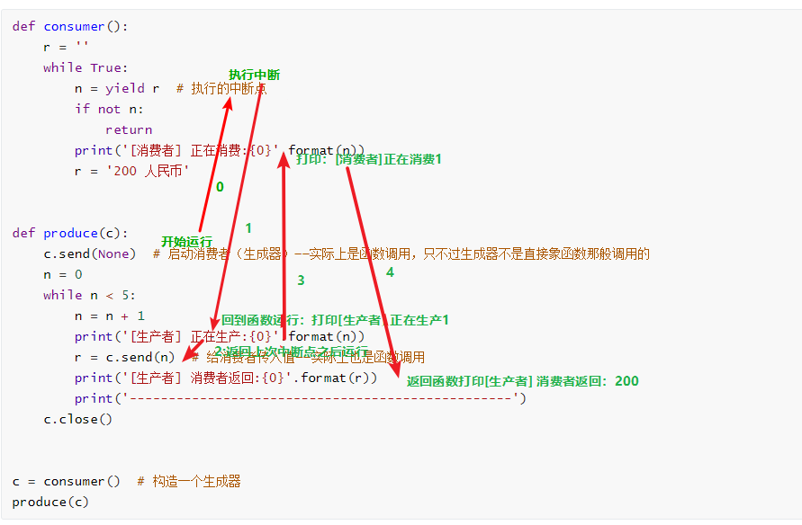

# 协程的简单理解及yield关键字实现协程

## 1.什么是协程（Coroutine）

**协程是python个中另外一种实现多任务的方式**，只不过比线程更小占用更小执行单元（理解为需要的资源）。 为啥说它是一个执行单元，因为它自带CPU上下文。这样只要在合适的时机， 我们可以把一个协程 切换到另一个协程。 只要这个过程中保存或恢复 CPU上下文那么程序还是可以运行的。

**通俗的理解：在一个线程中的某个函数，可以在任何地方保存当前函数的一些临时变量等信息，然后切换到另外一个函数中执行，注意不是通过调用函数的方式做到的，并且切换的次数以及什么时候再切换到原来的函数都由开发者自己确定**

## 2.协程（Coroutine的直观理解）

 yield个人认为其实是为了实现协程而出现的。所以如果要解释清楚什么是yield，那么也就必须要先搞懂什么是协程。首先明确一点：**协程是针对单个CPU的，也就是说，讲协程讲的就是单线程**。我们可以通过协程实现类似并发的任务，并且如果只是在一个CPU上的话，使用协程带来的效率一般都会比使用线程来的高。这是为啥呢？这就要看协程的原理了。等IO、等信号啥的，这些时间CPU给了你你也没用。

### 2.1为什么yield可以实现协程

yield具有一个延迟加载的特性，所谓的延迟加载就是当运行执行到yield关键词时，会保存当前程序运行状态，自动跳出当前函数遇到下次yield关键词会返回上一个yield关键词位置继续执行之后的代码，这就有了一个上下文概念。

在Python中，协程通过yield实现。因为当一个函数中有yield存在的时候，这个函数是生成器，那么当你调用这个函数的时候，你在函数体中写的代码并没有被执行，而是只返回了一个生成器对象，这个需要特别注意。然后，你的代码将会在每次使用这个生成器的时候被执行。①返回一个值、②接收调用者的参数中断等待的功能”，才使得yield可以实现协程。

### 2.2 yield实现协程的例子

```python
def consumer():
    r = ''
    while True:
        n = yield r  # 执行的中断点
        if not n:
            return
        print('[消费者] 正在消费:{0}'.format(n))
        r = '200 人民币'


def produce(c):
    c.send(None)  # 启动消费者（生成器）——实际上是函数调用，只不过生成器不是直接象函数那般调用的
    n = 0
    while n < 5:
        n = n + 1
        print('[生产者] 正在生产:{0}'.format(n))
        r = c.send(n)  # 给消费者传入值——实际上也是函数调用
        print('[生产者] 消费者返回:{0}'.format(r))
        print('-------------------------------------------------')
    c.close()


c = consumer()  # 构造一个生成器
produce(c)
```

运行结果：

```
[生产者] 正在生产:1
[消费者] 正在消费:1
[生产者] 消费者返回:200 人民币
-------------------------------------------------
[生产者] 正在生产:2
[消费者] 正在消费:2
[生产者] 消费者返回:200 人民币
-------------------------------------------------
[生产者] 正在生产:3
[消费者] 正在消费:3
[生产者] 消费者返回:200 人民币
-------------------------------------------------
[生产者] 正在生产:4
[消费者] 正在消费:4
[生产者] 消费者返回:200 人民币
-------------------------------------------------
[生产者] 正在生产:5
[消费者] 正在消费:5
[生产者] 消费者返回:200 人民币
-------------------------------------------------
```

**第一步：**在produce(c)函数中，调用了c.send(None)启动了生成器，这相当于是调用consumer(),但是如果consumer是一个普通函数而不是生成器，就要等到consumer执行完了，主动权才会重新回到producer手里。但就是因为consumer是生成器，所以第一次遇到yield暂停；接着执行produce()中接下来的代码，从运行结果看，确实打印出了[生产者] 正在生产 1 ，当程序运行至c.send(n)时，再次调用生成器并且通过yield传递了参数(n = 1)，这个时候，进入consumer()函数先前在yield停下的地方，继续向后执行，所以打印出[消费者] 正在消费 1。

**第二步：**[消费者] 正在消费 1 这句话被打印出来之后，接下consumer()函数中此时 r 被赋值为’200 人民币’,接着consumer()函数里面的第一次循环结束，进入第二次循环，又遇到yield， 所以consumer()函数又暂停并且返回变量 r 的值，consumer()函数暂停，此时程序又进入produce(c)函数中接着执行。

**第三步：**由于先前produce(c)函数接着第一次循环中c.send(n)处相当于是调用消费者consumer(),跳入到了consumer()里面去执行，现在consumer暂停，producer重新我有主动权，故而继续往下执行打印出[生产者] 消费者返回: 200 人民币，然后producer的第一次循环结束，并进行第二次循环，打印出[生产者] 正在生产 1，然后，又调用c.send(n) 又调用消费者consumer，将控制权交给consumer，如此循环回到第一步！



demo02:

```python
import time


# 定义一个消费者，他有名字name
# 因为里面有yield，本质上是一个生成器
def consumer(name):
    print(f'{name}  准备吃包子啦！呼吁店小二')
    while True:
        baozi = yield  # 接收send传的值，并将值赋值给变量baozi
        print(f'包子 {baozi + 1} 来了,被 {name} 吃了！')


# 定义一个生产者，生产包子的店家，店家有一个名字name,并且有两个顾客c1 c2
def producer(name, c1, c2):
    # next(c1)  # 启动生成器c1
    c1.send(None)  # 启动生成器c1
    c2.send(None)  # 启动生成器c2
    # next(c2)  # 启动生成器c2
    # next(c2)  # 启动生成器c2
    print(f'{name} 开始准备做包子啦！')
    for i in range(5):
        time.sleep(1)
        print(f'做了第{i + 1}包子，分成两半,你们一人一半')
        c1.send(i)
        c2.send(i)
        print('------------------------------------')


c1 = consumer('张三')  # 把函数变成一个生成器
# 张三  准备吃包子啦！呼吁店小二

c2 = consumer('李四')
# 李四  准备吃包子啦！呼吁店小二

producer('店小二', c1, c2)
# 店小二 开始准备做包子啦！
# 做了第1包子，分成两半,你们一人一半
# 包子 1 来了,被 张三 吃了！
# 包子 1 来了,被 李四 吃了！
# ------------------------------------
# 做了第2包子，分成两半,你们一人一半
# 包子 2 来了,被 张三 吃了！
# 包子 2 来了,被 李四 吃了！
# ------------------------------------
# ...
```

运行结果：

```
张三  准备吃包子啦！呼吁店小二
李四  准备吃包子啦！呼吁店小二
店小二 开始准备做包子啦！
做了第1包子，分成两半,你们一人一半
包子 1 来了,被 张三 吃了！
包子 1 来了,被 李四 吃了！
------------------------------------
做了第2包子，分成两半,你们一人一半
包子 2 来了,被 张三 吃了！
包子 2 来了,被 李四 吃了！
------------------------------------
做了第3包子，分成两半,你们一人一半
包子 3 来了,被 张三 吃了！
包子 3 来了,被 李四 吃了！
------------------------------------
做了第4包子，分成两半,你们一人一半
包子 4 来了,被 张三 吃了！
包子 4 来了,被 李四 吃了！
------------------------------------
做了第5包子，分成两半,你们一人一半
包子 5 来了,被 张三 吃了！
包子 5 来了,被 李四 吃了！
------------------------------------
```

解释分析：

**第一步：** 启动生成器c1,c2.c1先运行，运行到第一个循环的yield，暂停，然后c2运行，也运行到第一个yield暂停，打印得到

​       张三  准备吃包子啦！,呼吁店小二
​       李四  准备吃包子啦！,呼吁店小二

**第二步：**现在相当于两个顾客等着吃包子，控制权交给店小二生产包子，于是打印出 店小二 开始准备做包子啦！，并且进入producer的第一个循环，花了1秒钟，生产第一个包子，然后将其一分为二，打印出：做了第1包子，分成两半,你们一人一半。

**第三步：**此时producer店小二调用send()函数，相当于将包子给两位客人，这个时候先执行c1.send()，即先把包子给c1，然后c1获得了控制权，打印出包子 1 来了,被 张三 吃了！然后他吃完进入第二次循环遇见了yield，又暂停。控制权重新回到producer手上，他再执行c2.send()，将包子给c2，c2掌握控制权，于是打印出 包子 1 来了,被 李四 吃了！它在进入第二次循环，遇到yield，然后又暂停了，控制权重新回到producer店小二手中，店小二打印出一段虚线，然后进入第二次循环，重新花了1秒钟，又做了一个包子，一次这样下去。

demo03:

```python
def average():
    total = 0.0  # 数字的总和
    count = 0  # 数字的个数
    avg = None  # 平均值
    while True:
        num = yield avg
        total += num
        count += 1
        avg = total / count


# 定义一个函数，通过这个函数向average函数发送数值
def sender(generator):
    print(next(generator))  # 启动生成器
    print(generator.send(10))  # 10
    print(generator.send(20))  # 15
    print(generator.send(30))  # 20
    print(generator.send(40))  # 25


g = average()
sender(g)
```

运行结果：

```
None
10.0
15.0
20.0
25.0
```

## 3.协程的状态查看

我们都知道，协程是可以暂停等待、然后又恢复的生成器函数，那么我又没有什么方法查看一个协程到底是处于什么状态呢？

协程有四种状态，它们分别是

GEN_CREATED：等待执行

GEN_RUNNING：解释器执行

GEN_SUSPENDED：在yield表达式处暂停

GEN_CLOSED：执行结束

协程的状态可以用inspect.getgeneratorstate()函数来确定，实例如下：

```python
from inspect import getgeneratorstate  # 一定要导入
from time import sleep


def my_generator():
    for i in range(3):
        sleep(0.5)
        x = yield i + 1


def main(generator):
    try:
        print("生成器初始状态为:{0}".format(getgeneratorstate(g)))
        next(g)  # 激活生成器
        print("生成器初始状态为:{0}".format(getgeneratorstate(g)))
        g.send(100)
        print("生成器初始状态为:{0}".format(getgeneratorstate(g)))
        next(g)
        print("生成器初始状态为:{0}".format(getgeneratorstate(g)))
        next(g)
    except StopIteration:
        print('全部迭代完毕了')
        print("生成器初始状态为:{0}".format(getgeneratorstate(g)))


g = my_generator()  # 创建一个生成器对象
main(g)
```

运行结果：

```
生成器初始状态为:GEN_CREATED
生成器初始状态为:GEN_SUSPENDED
生成器初始状态为:GEN_SUSPENDED
生成器初始状态为:GEN_SUSPENDED
全部迭代完毕了
生成器初始状态为:GEN_CLOSED
```

## 4.yield实现协程的不足之处

（1）协程函数的返回值不是特别方便获取，为什么参见上一篇文章，只能够通过出发StopIteration异常，然后通过该异常的value属性获取；

（2）Python的生成器是协程`coroutine`的一种形式，但它的局限性在于只能向它的直接调用者每次yield一个值。这意味着那些包含yield的代码不能想其他代码那样被分离出来放到一个单独的函数中。这也正是`yield from`要解决的。