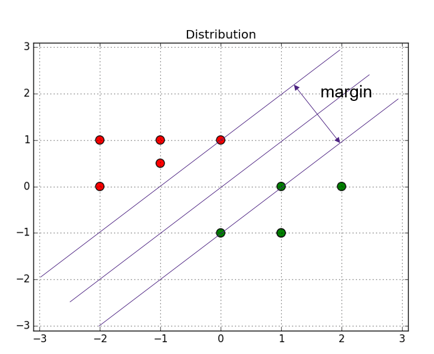

# 10. 支持向量机(SVM)中的支持向量是什么意思

<iframe src="https://ghbtns.com/github-btn.html?user=geektutu&repo=interview-questions&type=star&count=true&size=large" frameborder="0" scrolling="0" width="160px" height="30px"></iframe>

## 题目

我们在下面的二元标签的数据集上训练一个线性SVM模型

```python
+：(−1,1),(1,−1),(−1,−1)
−：(1,1),(2,0),(2,1)
```

这个模型中的支持向量是哪些？

A. (−1,1),(1,1),(2,1)
B. (−1,1),(−1,−1),(2,1)
C. (−1,1),(1,−1),(1,1),(2,0)

## 解析



在画分割线区分红绿两类点的时候，可以问自己一个问题，你认不认为所有的点对于分割线的位置都是起决定性作用的？

其实在特别远的区域，哪怕你增加10000个样本点，对于分割线的位置，也是没有作用的，因为分割线是由几个关键点决定的（图上三个），这几个关键点支撑起了一个分割超平面，所以这些关键点，就是支持向量。

## 参考文档

- [支持向量机（SVM）里的支持向量是什么意思 - sofasofa](http://sofasofa.io/forum_main_post.php?postid=1000255)
- [支持向量机(SVM)是什么意思？- 知乎](https://www.zhihu.com/question/21094489)

## 答案

在坐标系中画一下，即可知道C是正确答案